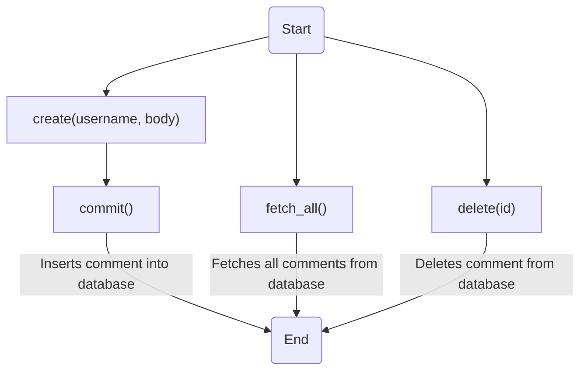

# Comment.java: Comment Management

## Overview
The `Comment.java` class is responsible for managing comments in the application. It provides functionalities to create, fetch, delete comments and commit changes to the database.

## Process Flow

## Insights
- The `Comment` class has four attributes: `id`, `username`, `body`, and `created_on`.
- The `create` method generates a new comment with a unique ID and current timestamp, and commits it to the database.
- The `fetch_all` method retrieves all comments from the database.
- The `delete` method removes a comment from the database based on its ID.
- The `commit` method is a private method used to commit changes to the database.

## Dependencies

- `Postgres` : The `Postgres` class is used to establish a connection with the PostgreSQL database. It is used in the `create`, `fetch_all`, `delete`, and `commit` methods.

## Data Manipulation (SQL)

- `comments`: The `comments` table in the database is manipulated in this class. The table structure and the SQL operations performed are as follows:

| Attribute  | Type       | Description |
|------------|------------|-------------|
| id         | String     | Unique identifier for the comment |
| username   | String     | Username of the comment author |
| body       | String     | Text content of the comment |
| created_on | Timestamp  | Timestamp when the comment was created |

- `comments`: The `INSERT INTO` command is used in the `commit` method to insert a new comment into the `comments` table.
- `comments`: The `SELECT * FROM` command is used in the `fetch_all` method to retrieve all comments from the `comments` table.
- `comments`: The `DELETE FROM` command is used in the `delete` method to remove a comment from the `comments` table based on its ID.
