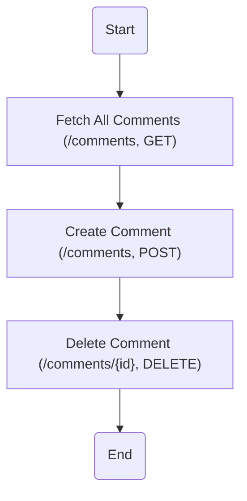
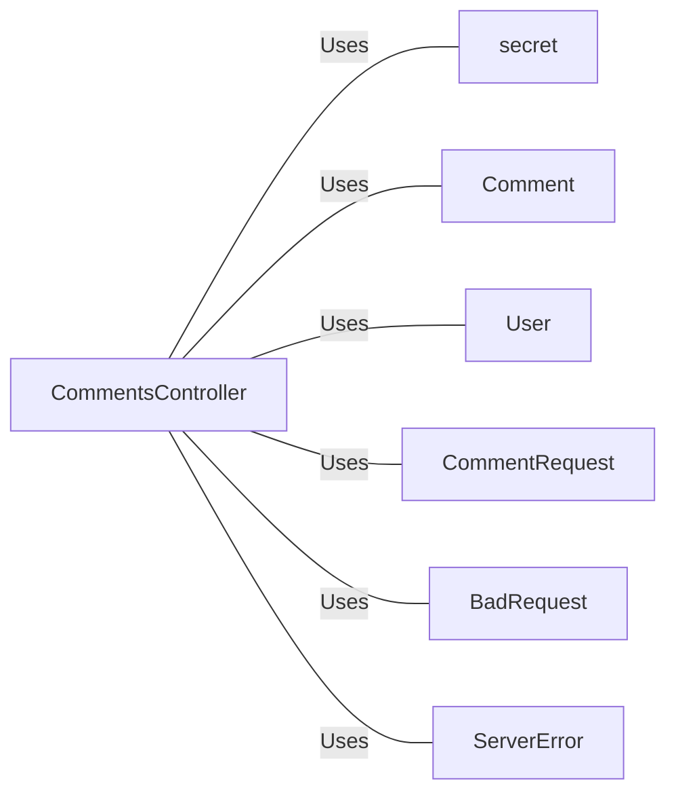

# CommentsController.java: Comment Management System

## Overview
The `CommentsController.java` is a RESTful API controller that manages comments in an application. It provides endpoints for fetching all comments, creating a new comment, and deleting a comment.

## Process Flow

## Insights
- The `CommentsController` class is annotated with `@RestController` and `@EnableAutoConfiguration`, which means it's a RESTful web service controller and it enables auto-configuration of the Spring Application Context.
- The `secret` variable is injected from the application properties file using the `@Value` annotation.
- The `comments`, `createComment`, and `deleteComment` methods are mapped to `/comments` endpoint with different HTTP methods (GET, POST, DELETE respectively).
- All the endpoints are enabled for Cross-Origin Resource Sharing (CORS) with all origins (`*`).
- The `comments` method fetches all comments, `createComment` creates a new comment, and `deleteComment` deletes a comment with a specific id.
- The `CommentRequest` class is a data structure that represents the request body for creating a new comment. It implements `Serializable` interface.
- The `BadRequest` and `ServerError` classes are custom exceptions that represent HTTP 400 and 500 status codes respectively. They are annotated with `@ResponseStatus`.

## Dependencies

- `secret` : The application secret used for authentication. It's injected from the application properties file.
- `Comment` : The data structure representing a comment. It's used for fetching all comments, creating a new comment, and deleting a comment.
- `User` : The data structure representing a user. It's used for asserting user authentication.
- `CommentRequest` : The data structure representing the request body for creating a new comment.
- `BadRequest` : The custom exception representing HTTP 400 status code.
- `ServerError` : The custom exception representing HTTP 500 status code.
