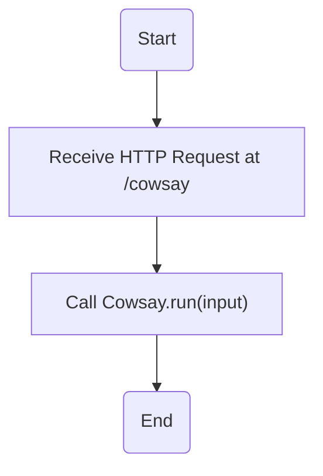
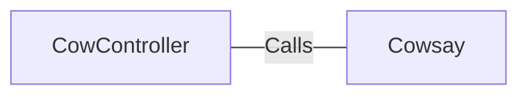

# CowController.java: Cow Controller

## Overview
The `CowController` class is a REST controller in a Spring Boot application. It is responsible for handling HTTP requests to the `/cowsay` endpoint. The endpoint accepts a string input and returns a string response generated by the `Cowsay` class.

## Process Flow

## Insights
- The `CowController` class is annotated with `@RestController` and `@EnableAutoConfiguration`, which are Spring Boot annotations. The `@RestController` annotation is used to define a controller in a Spring Boot application, and the `@EnableAutoConfiguration` annotation tells Spring Boot to start adding beans based on classpath settings, other beans, and various property settings.
- The `cowsay` method is annotated with `@RequestMapping(value = "/cowsay")`, which maps HTTP requests to the `/cowsay` path to this method.
- The `cowsay` method accepts a `String` parameter `input` with a default value of "I love Linux!".
- The `cowsay` method calls the `run` method of the `Cowsay` class with the `input` parameter and returns the result.

## Dependencies

- `Cowsay` : The `CowController` class calls the `run` method of the `Cowsay` class. The `run` method accepts a `String` parameter and returns a `String`.
