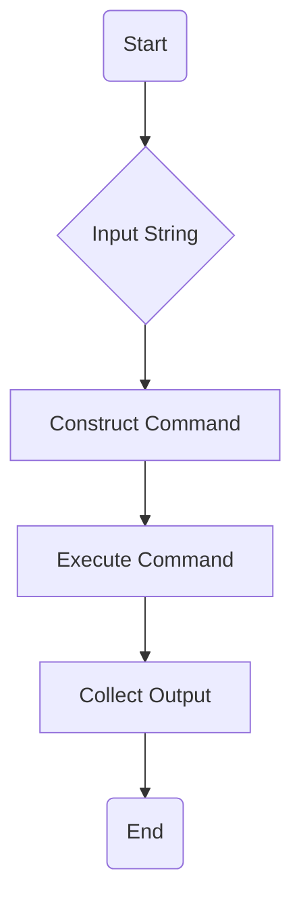
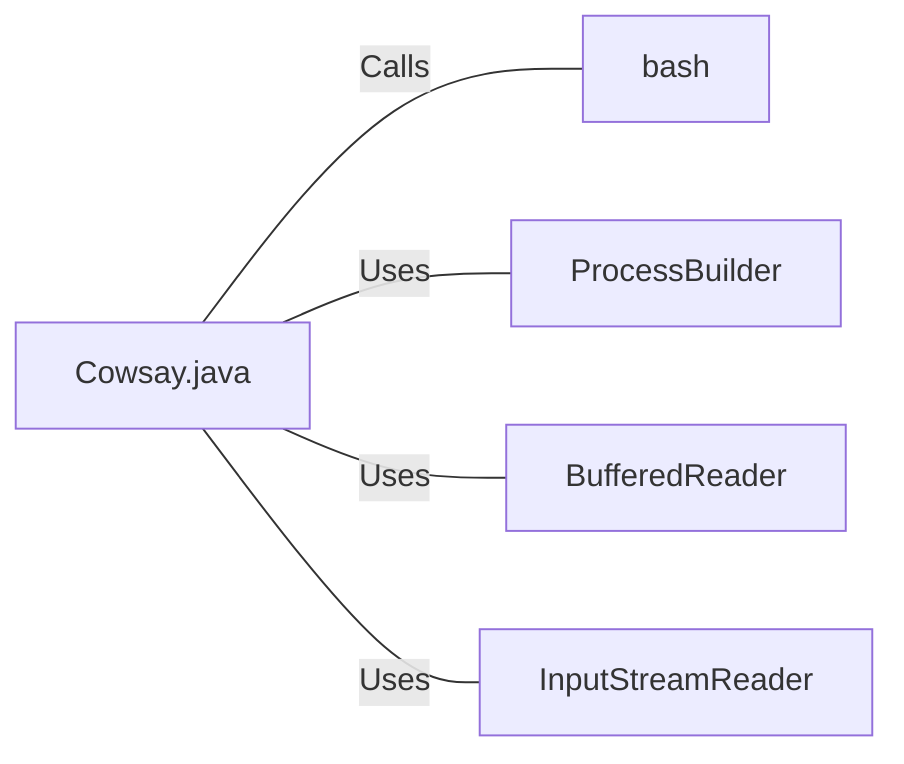

# Cowsay.java: Command Execution Wrapper

## Overview
The `Cowsay.java` file is a simple Java class that acts as a wrapper for the execution of the `cowsay` command in a Unix-like environment. The `cowsay` command is a program that generates ASCII pictures of a cow with a message. The class contains a single public static method `run(String input)` which takes a string as input, executes the `cowsay` command with the input string as a parameter, and returns the output of the command.

## Process Flow

## Insights
- The `run(String input)` method is the main method of the `Cowsay` class. It takes a string as input, which is used as the message for the `cowsay` command.
- The `cowsay` command is executed in a new process using the `ProcessBuilder` class.
- The output of the `cowsay` command is collected from the process's input stream and returned as a string.
- If an exception occurs during the execution of the command, it is caught and printed to the standard error stream.

## Dependencies

- `bash` : The `bash` shell is used to execute the `cowsay` command. The command is constructed as a string and passed to `bash` with the `-c` option.
- `ProcessBuilder` : This class is used to create a new process in which to execute the `cowsay` command.
- `BufferedReader` : This class is used to read the output of the `cowsay` command from the process's input stream.
- `InputStreamReader` : This class is used to convert the process's input stream, which is in byte format, into a character stream that can be read by the `BufferedReader`.
