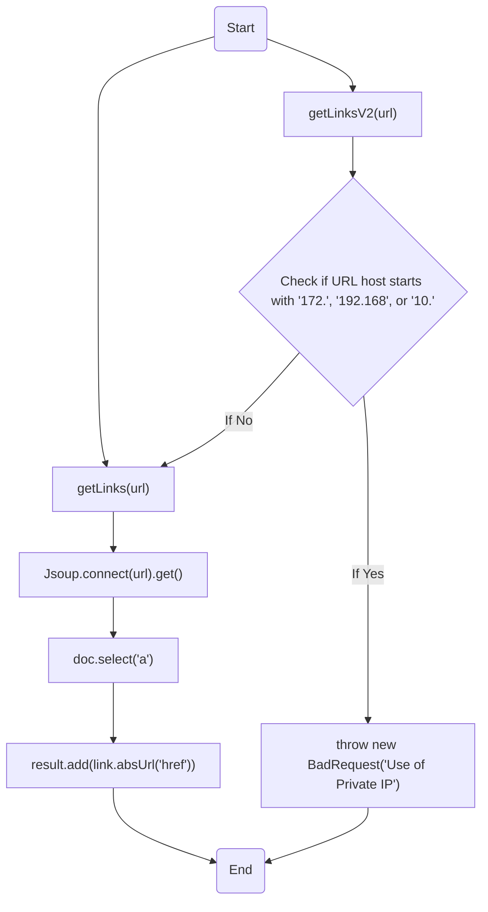
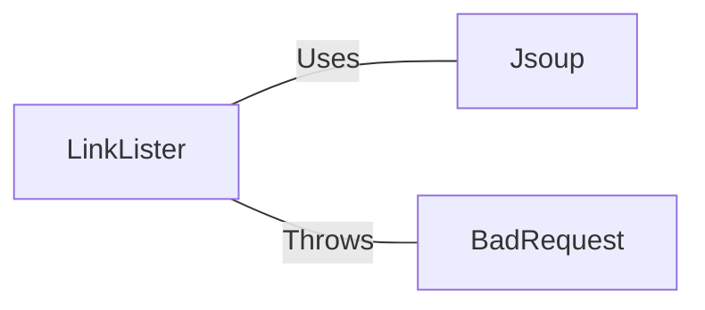

# LinkLister.java: Web Link Extraction Utility

## Overview
The `LinkLister` class is a utility for extracting all the hyperlinks from a given URL. It provides two methods for this purpose: `getLinks` and `getLinksV2`. The `getLinks` method simply extracts all the links from the provided URL, while `getLinksV2` adds an additional check to prevent the use of private IP addresses.

## Process Flow

## Insights
- The `getLinks` method uses the Jsoup library to parse the HTML of the provided URL and extract all the hyperlinks.
- The `getLinksV2` method adds an additional security check to prevent the use of private IP addresses. If the host of the provided URL starts with '172.', '192.168', or '10.', a `BadRequest` exception is thrown.
- The `BadRequest` exception is a custom exception, presumably defined elsewhere in the application.

## Dependencies

- `Jsoup` : The Jsoup library is used to parse the HTML of the provided URL and extract all the hyperlinks. It is called in the `getLinks` and `getLinksV2` methods.
- `BadRequest` : A custom exception presumably defined elsewhere in the application. It is thrown in the `getLinksV2` method when the host of the provided URL starts with '172.', '192.168', or '10.'.

