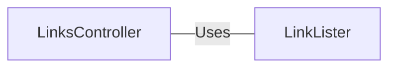

# LinksController.java: Web Controller for Link Listing

## Overview
The `LinksController` class is a Spring Boot REST controller that provides two endpoints for listing links. The endpoints are `/links` and `/links-v2`, both of which accept a URL as a request parameter and return a list of links found on the provided URL.

## Process Flow

```mermaid
graph TD
  Start("Start") --> A["/links Endpoint"]
  A --> B{LinkLister.getLinks(url)}
  B --> End("End")
  Start --> C["/links-v2 Endpoint"]
  C --> D{LinkLister.getLinksV2(url)}
  D --> End
```

## Insights
- The `LinksController` class is a REST controller, as indicated by the `@RestController` annotation.
- The `@EnableAutoConfiguration` annotation tells Spring Boot to start adding beans based on classpath settings, other beans, and various property settings.
- The `/links` endpoint uses the `LinkLister.getLinks(url)` method to retrieve the links from the provided URL.
- The `/links-v2` endpoint uses the `LinkLister.getLinksV2(url)` method to retrieve the links from the provided URL.
- Both endpoints produce a JSON response, as indicated by the `produces = "application/json"` parameter in the `@RequestMapping` annotation.

## Dependencies
The `LinksController` class has dependencies on the following classes:

- `LinkLister`: This class provides the methods `getLinks(url)` and `getLinksV2(url)` used by the `/links` and `/links-v2` endpoints respectively.



- `LinkLister` : The `LinkLister` class provides the methods `getLinks(url)` and `getLinksV2(url)` which are used by the `LinksController` to retrieve the links from the provided URL. The `url` parameter is a string representing the URL from which to retrieve the links.
