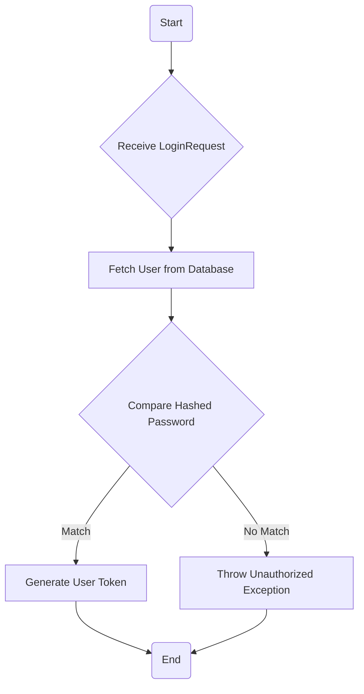
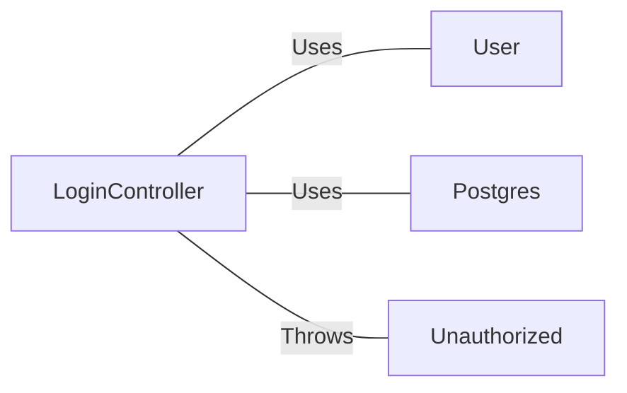

# LoginController.java: User Authentication Controller

## Overview
The `LoginController` class is a REST controller that handles user authentication in the application. It exposes a POST endpoint at `/login` that accepts a JSON payload containing a username and password. If the provided credentials are valid, it returns a JSON response containing a token. If the credentials are invalid, it throws an `Unauthorized` exception.

## Process Flow

## Insights
- The `LoginController` class is annotated with `@RestController` and `@EnableAutoConfiguration`, indicating that it is a Spring Boot application with auto-configuration enabled.
- The `/login` endpoint is configured to accept cross-origin requests from any origin (`@CrossOrigin(origins = "*")`).
- The `secret` used for token generation is fetched from the application's configuration (`@Value("${app.secret}")`).
- The `LoginRequest` and `LoginResponse` classes implement the `Serializable` interface, allowing their instances to be serialized and deserialized.
- The `Unauthorized` class extends `RuntimeException` and is annotated with `@ResponseStatus(HttpStatus.UNAUTHORIZED)`, meaning that it will result in an HTTP 401 Unauthorized response when thrown.

## Dependencies

- `User` : The `User` class is used to fetch user data from the database and generate a token for the user. The `User.fetch()` method is called with the username as a parameter, and the `User.token()` method is called with the secret as a parameter.
- `Postgres` : The `Postgres` class is used to hash the password provided in the `LoginRequest`. The `Postgres.md5()` method is called with the password as a parameter.
- `Unauthorized` : The `Unauthorized` exception is thrown when the hashed password provided in the `LoginRequest` does not match the hashed password stored in the `User` object. The exception is instantiated with "Access Denied" as the message.

## Data Manipulation (SQL)
- `User`: The `User` class likely interacts with a database table to fetch user data and validate the provided credentials. The exact SQL operations performed are not visible in the provided code.
