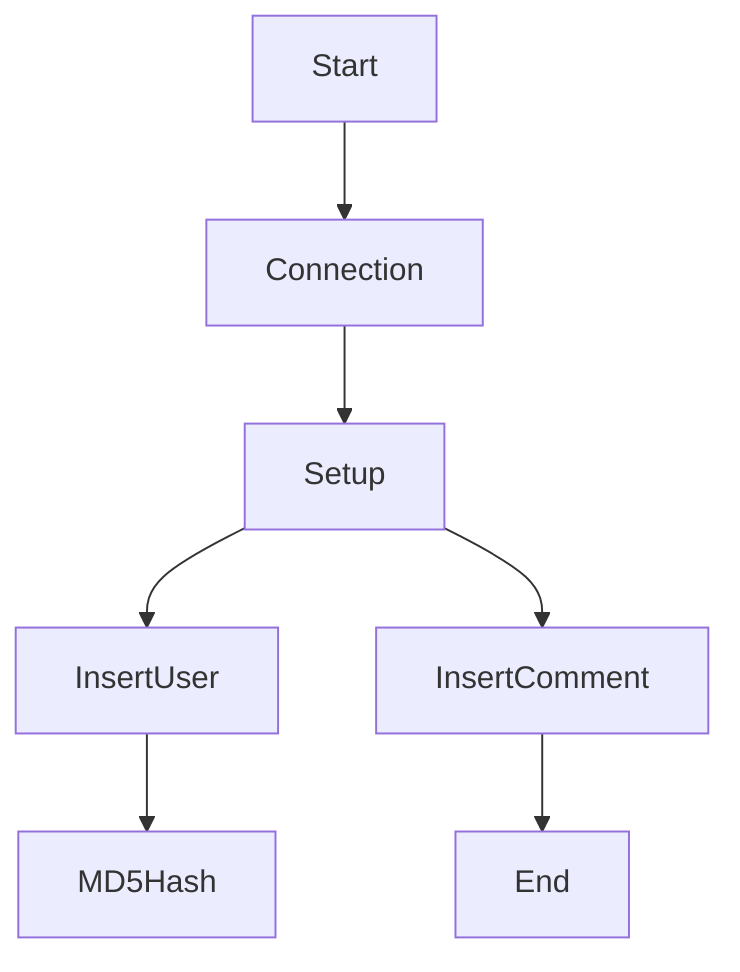
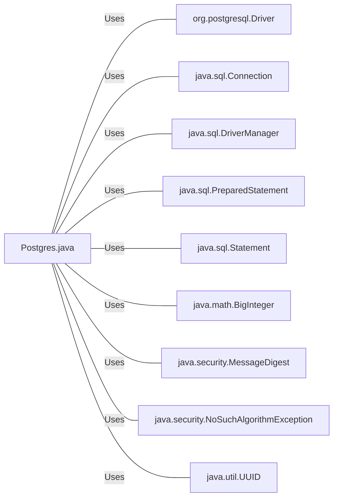

# Postgres.java: PostgreSQL Database Connection and Operations

## Overview
The `Postgres.java` file is responsible for establishing a connection to a PostgreSQL database, setting up the database schema, and performing operations such as inserting users and comments into the database. It also includes a method for generating an MD5 hash of a given input string.

## Process Flow

## Insights
- The `connection()` method is used to establish a connection to the PostgreSQL database.
- The `setup()` method is responsible for setting up the database schema and inserting seed data into the `users` and `comments` tables.
- The `md5()` method is used to generate an MD5 hash of a given input string.
- The `insertUser()` and `insertComment()` methods are used to insert data into the `users` and `comments` tables respectively.

## Dependencies

- `org.postgresql.Driver` : PostgreSQL JDBC driver used to connect to the database.
- `java.sql.Connection` : Represents a connection with a database.
- `java.sql.DriverManager` : Manages a list of database drivers.
- `java.sql.PreparedStatement` : Represents a precompiled SQL statement.
- `java.sql.Statement` : Used for executing static SQL statements to retrieve data from the database.
- `java.math.BigInteger` : Immutable arbitrary-precision integers used in the MD5 hash calculation.
- `java.security.MessageDigest` : Provides functionality of a message digest algorithm, such as MD5 or SHA.
- `java.security.NoSuchAlgorithmException` : Signals that a requested algorithm could not be found.
- `java.util.UUID` : Represents a universally unique identifier (UUID).

## Data Manipulation (SQL)
- `users`: Table for storing user data. The SQL operation performed is INSERT.
- `comments`: Table for storing comments data. The SQL operation performed is INSERT.

| Table Name | Attribute | Data Type | Description |
|------------|-----------|-----------|-------------|
| users      | user_id   | VARCHAR   | Unique identifier for the user |
| users      | username  | VARCHAR   | Username of the user |
| users      | password  | VARCHAR   | Password of the user (stored as MD5 hash) |
| users      | created_on| TIMESTAMP | Timestamp of when the user was created |
| users      | last_login| TIMESTAMP | Timestamp of the user's last login |
| comments   | id        | VARCHAR   | Unique identifier for the comment |
| comments   | username  | VARCHAR   | Username of the user who made the comment |
| comments   | body      | VARCHAR   | Body of the comment |
| comments   | created_on| TIMESTAMP | Timestamp of when the comment was created |
