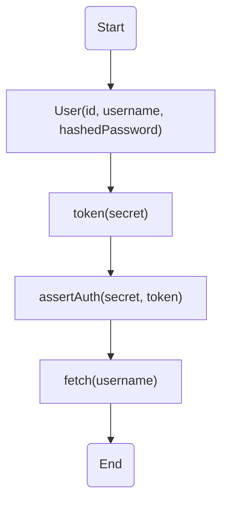
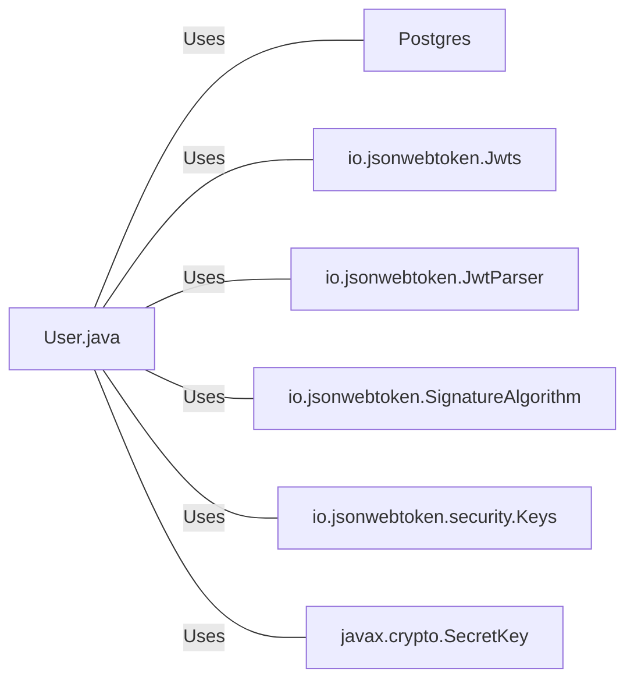

# User.java: User Authentication and Management

## Overview
The `User.java` class is responsible for managing user data and authentication. It provides functionalities for creating a user, generating a token for a user, asserting user authentication, and fetching user data from a database.

## Process Flow

## Insights
- The `User` class has three attributes: `id`, `username`, and `hashedPassword`.
- The `User` constructor initializes a new user with an `id`, `username`, and `hashedPassword`.
- The `token` method generates a JWT token for a user using a secret key.
- The `assertAuth` method validates a JWT token using a secret key.
- The `fetch` method retrieves a user from the database using the username.

## Dependencies

- `Postgres` : The `Postgres` class is used to establish a connection with the database. The `fetch` method uses this connection to retrieve user data.
- `io.jsonwebtoken.Jwts` : This library is used to generate and parse JWT tokens.
- `io.jsonwebtoken.JwtParser` : This library is used to parse JWT tokens.
- `io.jsonwebtoken.SignatureAlgorithm` : This library is used to specify the algorithm used for signing the JWT token.
- `io.jsonwebtoken.security.Keys` : This library is used to generate secret keys for signing the JWT token.
- `javax.crypto.SecretKey` : This library is used to represent secret keys for cryptographic operations.

## Data Manipulation (SQL)

- `users`: The `fetch` method performs a SELECT operation on the `users` table to retrieve a user with a specific username. The SQL query is: `select * from users where username = '" + un + "' limit 1`.
