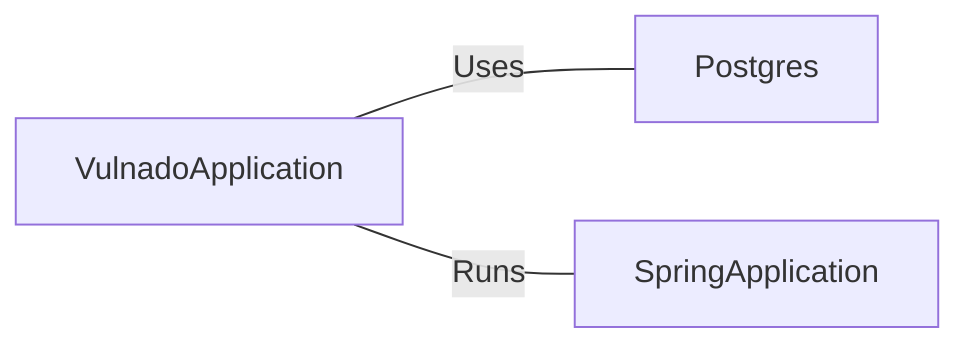

# VulnadoApplication.java: Spring Boot Application

## Overview
The `VulnadoApplication.java` is a Spring Boot application that sets up a Postgres database and runs the application.

## Process Flow
```mermaid
graph TD
    Start("Start") --> Postgres_Setup{Postgres.setup()}
    Postgres_Setup --> SpringApplication_Run{SpringApplication.run(VulnadoApplication.class, args)}
    SpringApplication_Run --> End("End")
```

## Insights
- The application sets up a Postgres database before running the Spring Boot application.
- The `@SpringBootApplication` annotation indicates that it's a Spring Boot application.
- The `@ServletComponentScan` annotation enables the scanning of Servlet components.

## Dependencies

- `Postgres` : The application sets up a Postgres database before running. The nature of the relation is 'Uses'.
- `SpringApplication` : The application runs using SpringApplication. The nature of the relation is 'Runs'.
