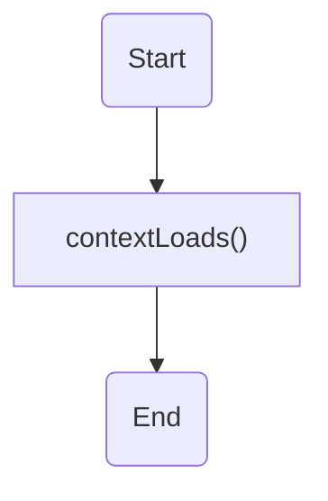
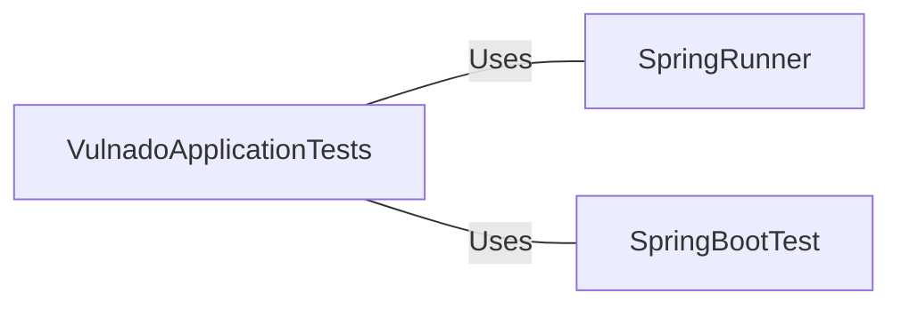

# VulnadoApplicationTests.java: Unit Test for Vulnado Application

## Overview
The `VulnadoApplicationTests` is a unit test class for the Vulnado application. It is designed to test the application context loading.

## Process Flow

The process flow starts with the initiation of the test. The `contextLoads()` method is called to test the application context loading. The process ends after the test is completed.

## Insights
- The `VulnadoApplicationTests` class is a unit test class for the Vulnado application.
- The `contextLoads()` method is used to test the application context loading.

## Dependencies

- `SpringRunner` : Provides support for loading Spring ApplicationContext and having beans auto-injected. It's a more advanced version of the SpringJUnit4ClassRunner. SpringRunner is used to launch the Spring context while executing tests.
- `SpringBootTest` : Annotation that can be specified on a test class that runs Spring Boot based tests. It provides the following features over and above the regular Spring TestContext Framework: Detects TestConfiguration, Auto-configures Spring Boot application, Auto-configures MockMvc.

## Data Manipulation (SQL)
No SQL data manipulation is detected in this code.
