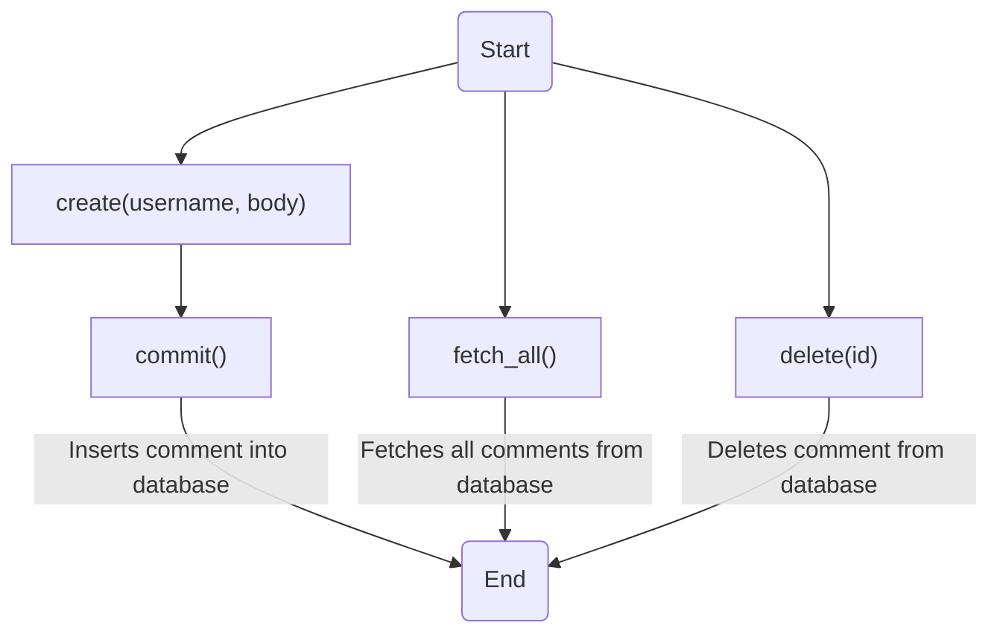

# Comment.java: Comment Management

## Overview
The `Comment.java` class is responsible for managing comments in the application. It provides functionalities to create, fetch, and delete comments. Each comment is associated with a unique ID, username, body, and timestamp.

## Process Flow

## Insights
- The `Comment` class uses a `Postgres` connection to interact with the database.
- The `create` method generates a new comment with a unique ID and current timestamp, and commits it to the database.
- The `fetch_all` method retrieves all comments from the database.
- The `delete` method removes a comment from the database based on its ID.
- The `commit` method is a private method used to insert a comment into the database.

## Dependencies

- `Postgres` : The `Comment` class uses the `Postgres` connection to interact with the database. It uses this connection to execute SQL queries for creating, fetching, and deleting comments.

## Data Manipulation (SQL)

- `comments`: The `Comment` class interacts with the `comments` table in the database. It performs the following operations:
  - `INSERT INTO comments (id, username, body, created_on) VALUES (?,?,?,?)`: Inserts a new comment into the `comments` table.
  - `select * from comments;`: Fetches all comments from the `comments` table.
  - `DELETE FROM comments where id = ?`: Deletes a comment from the `comments` table based on its ID.

| Attribute | Type | Description |
|-----------|------|-------------|
| id | String | Unique identifier for the comment |
| username | String | Username of the user who created the comment |
| body | String | Body of the comment |
| created_on | Timestamp | Timestamp when the comment was created |
