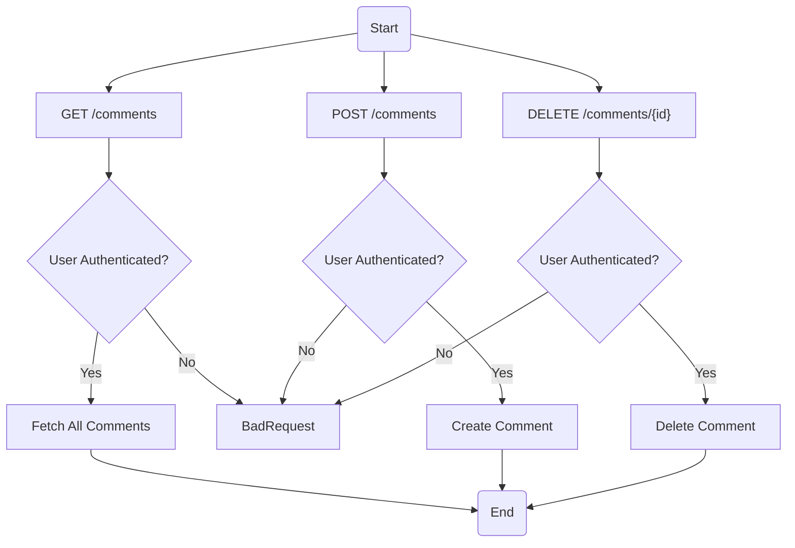
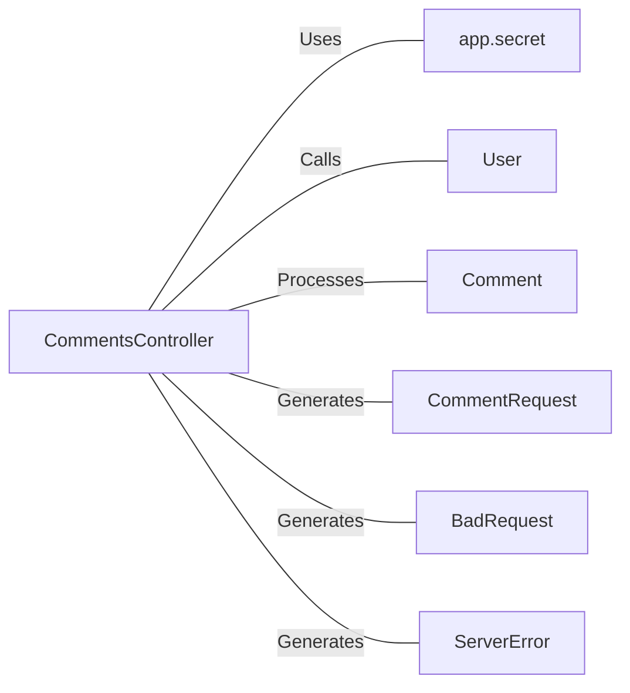

# CommentsController.java: Comments Management Controller

## Overview
The `CommentsController` class is a RESTful web service controller. The APIs allow clients to perform various operations related to comments, such as fetching all comments, creating a new comment, and deleting a comment.

## Process Flow

## Insights
- The `CommentsController` class is annotated with `@RestController` and `@EnableAutoConfiguration`, indicating that it's a REST controller and it should enable auto-configuration of the Spring Application Context.
- The `secret` variable is injected using the `@Value` annotation, which indicates that the value of this variable should be fetched from the application's configuration properties.
- The `comments`, `createComment`, and `deleteComment` methods are mapped to the `/comments` endpoint for GET, POST, and DELETE HTTP methods respectively. They all require an `x-auth-token` header for user authentication.
- The `CommentRequest` class is a simple data structure that holds the `username` and `body` of a comment.
- The `BadRequest` and `ServerError` classes are custom exceptions that are thrown when there's a bad request or server error respectively. They are annotated with `@ResponseStatus` to indicate the HTTP status code that should be returned when these exceptions are thrown.

## Dependencies

- `app.secret` : The application secret used for user authentication. It's fetched from the application's configuration properties.
- `User` : The `User` class is used for user authentication. The `assertAuth` method is called with the `secret` and `token` as parameters.
- `Comment` : The `Comment` class is used for comment operations. The `fetch_all`, `create`, and `delete` methods are called for fetching all comments, creating a comment, and deleting a comment respectively.
- `CommentRequest` : The `CommentRequest` class is a data structure that holds the `username` and `body` of a comment. It's used as a parameter for the `createComment` method.
- `BadRequest` : The `BadRequest` class is a custom exception that's thrown when there's a bad request. It's annotated with `@ResponseStatus` to indicate the HTTP status code that should be returned when this exception is thrown.
- `ServerError` : The `ServerError` class is a custom exception that's thrown when there's a server error. It's annotated with `@ResponseStatus` to indicate the HTTP status code that should be returned when this exception is thrown.
