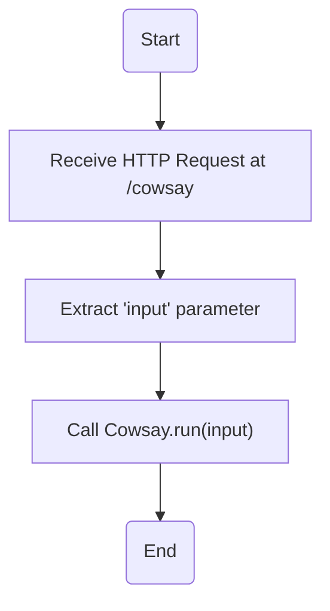
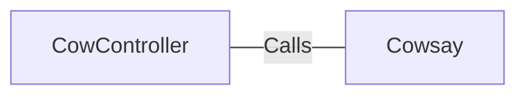

# CowController.java: Cow Controller

## Overview
The `CowController` class is a REST controller in a Spring Boot application. It is responsible for handling HTTP requests to the `/cowsay` endpoint. The endpoint accepts a string parameter and returns a string response generated by the `Cowsay` class.

## Process Flow

## Insights
- The `CowController` class is annotated with `@RestController` and `@EnableAutoConfiguration`, which are Spring Boot annotations that indicate this class is a REST controller and should be automatically configured by Spring Boot.
- The `cowsay` method is mapped to the `/cowsay` endpoint via the `@RequestMapping` annotation. It accepts an HTTP request with an optional 'input' parameter. If no 'input' parameter is provided, the default value "I love Linux!" is used.
- The `cowsay` method calls the `Cowsay.run(input)` method and returns its output.

## Dependencies

- `Cowsay` : The `CowController` calls the `Cowsay.run(input)` method, passing the 'input' parameter received from the HTTP request. The `Cowsay.run(input)` method generates a string response based on the 'input' parameter.
