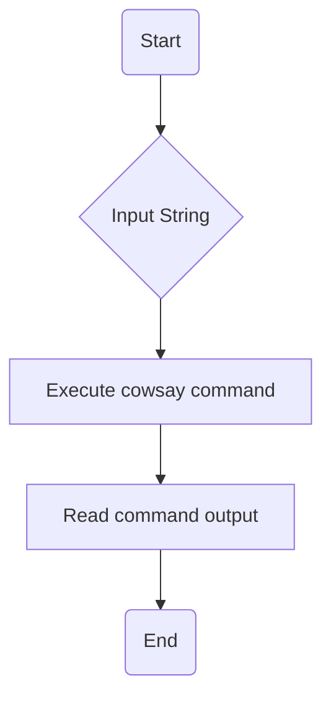
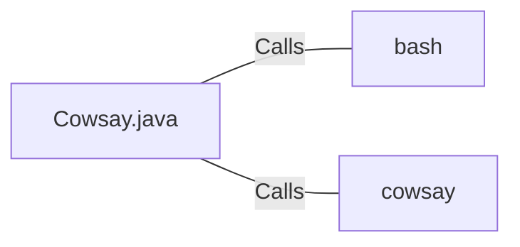

# Cowsay.java: Command Execution Wrapper

## Overview
The `Cowsay.java` file is a simple Java class that provides a wrapper for executing the `cowsay` command in a Unix-like environment. The `cowsay` command is a program that generates ASCII pictures of a cow with a message. The class has a single public method `run(String input)` which takes a string as input, executes the `cowsay` command with the input string as a parameter, and returns the output of the command.

## Process Flow

## Insights
- The `run(String input)` method constructs a command string by appending the input string to the `cowsay` command.
- The command is executed in a bash shell using a `ProcessBuilder` object.
- The output of the command is read from the process's input stream and appended to a `StringBuilder` object.
- If an exception occurs during the execution of the command or the reading of the output, it is caught and printed to the standard error stream.
- The output of the command is returned as a string.

## Dependencies

- `bash` : The bash shell is used to execute the `cowsay` command. The command string is passed as a parameter to the bash shell.
- `cowsay` : The `cowsay` command is executed with the input string as a parameter. The output of the command is read and returned by the `run(String input)` method.
