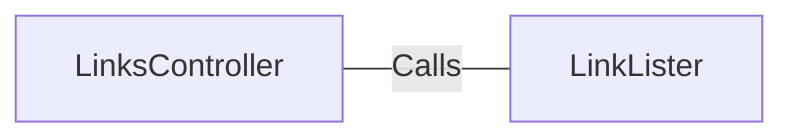

# LinksController.java: Web Controller for Link Listing

## Overview
The `LinksController` class is a web controller in a Spring Boot application that exposes two endpoints (`/links` and `/links-v2`) for retrieving a list of links from a given URL.

## Process Flow

```mermaid
graph TD
  Start("Start") --> A["/links Endpoint"]
  A --> B{LinkLister.getLinks(url)}
  B --> End("End")
  Start --> C["/links-v2 Endpoint"]
  C --> D{LinkLister.getLinksV2(url)}
  D --> End
```

## Insights
- The `LinksController` class is annotated with `@RestController` and `@EnableAutoConfiguration`, which are Spring Boot annotations that indicate this class is a REST controller and should be automatically configured by Spring Boot.
- The `links` method is mapped to the `/links` endpoint and produces JSON responses. It takes a URL as a request parameter and returns a list of links from the given URL by calling the `getLinks` method of the `LinkLister` class.
- The `linksV2` method is mapped to the `/links-v2` endpoint and also produces JSON responses. It takes a URL as a request parameter and returns a list of links from the given URL by calling the `getLinksV2` method of the `LinkLister` class.

## Dependencies

- `LinkLister` : The `LinksController` class calls the `getLinks` and `getLinksV2` methods of the `LinkLister` class. These methods take a URL as a parameter and return a list of links from the given URL.
