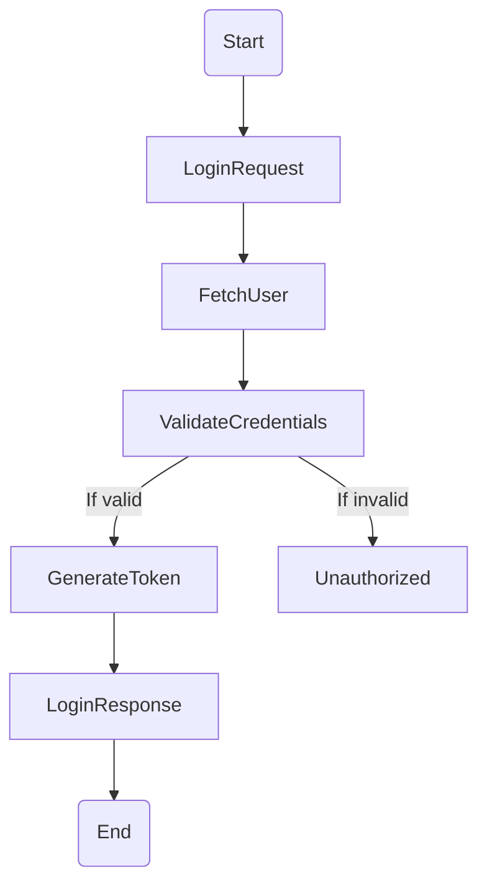
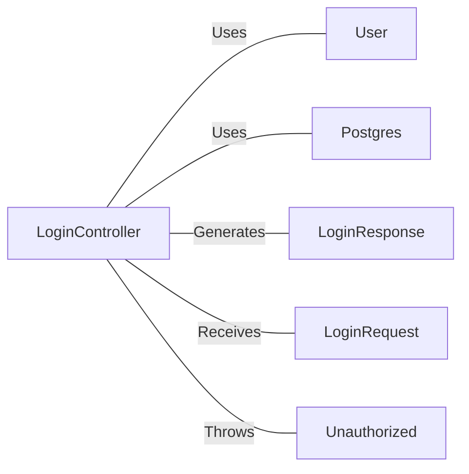

# LoginController.java: User Authentication Controller

## Overview
The `LoginController` class is responsible for handling user login requests. It receives a `LoginRequest` object, validates the user credentials, and returns a `LoginResponse` object containing a token if the credentials are valid. If the credentials are invalid, it throws an `Unauthorized` exception.

## Process Flow

## Insights
- The `LoginController` class is annotated with `@RestController` and `@EnableAutoConfiguration`, indicating that it is a REST controller and should be automatically configured by Spring Boot.
- The `login` method is mapped to the `/login` endpoint and accepts POST requests. It consumes and produces JSON.
- The `login` method fetches a `User` object using the username from the `LoginRequest`, and compares the hashed password with the password from the `LoginRequest`.
- If the passwords match, a new `LoginResponse` is created with a token generated by the `User` object.
- If the passwords do not match, an `Unauthorized` exception is thrown.
- The `LoginRequest` and `LoginResponse` classes implement `Serializable`, allowing them to be converted to a byte stream for storage or transmission.
- The `Unauthorized` class extends `RuntimeException` and is annotated with `@ResponseStatus(HttpStatus.UNAUTHORIZED)`, causing it to return a 401 Unauthorized HTTP status code when thrown.

## Dependencies

- `User` : The `User` class is used to fetch user data and generate a token. The `User.fetch` method is called with the username from the `LoginRequest`, and the `User.token` method is called with the secret to generate a token.
- `Postgres` : The `Postgres` class is used to hash the password from the `LoginRequest`. The `Postgres.md5` method is called with the password.
- `LoginResponse` : The `LoginResponse` class is used to create a response containing a token. A new `LoginResponse` is created with the token generated by the `User` object.
- `LoginRequest` : The `LoginRequest` class is used to receive the username and password from the client. It is passed as a parameter to the `login` method.
- `Unauthorized` : The `Unauthorized` class is used to throw an exception when the credentials are invalid. It is thrown with the message "Access Denied".
