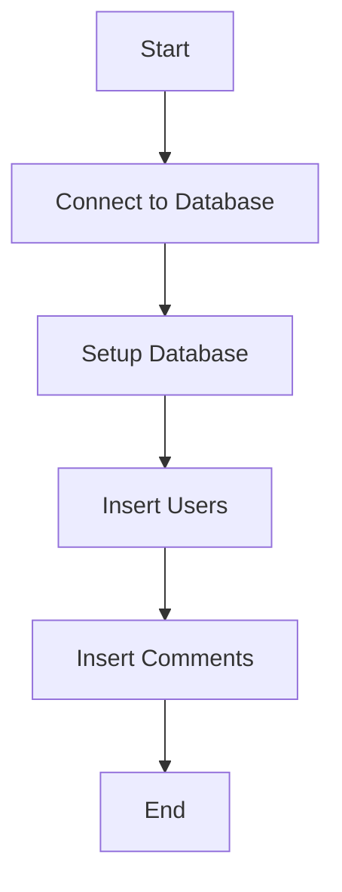
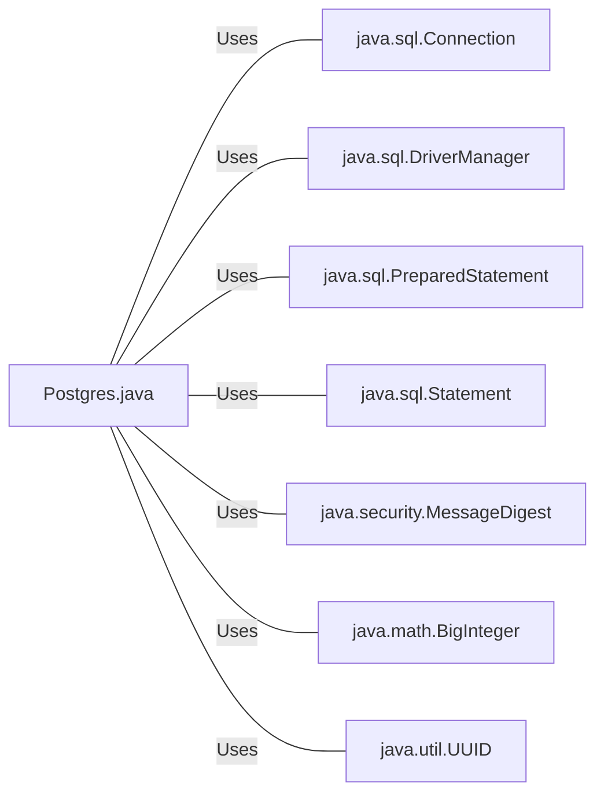

# Postgres.java: PostgreSQL Database Operations

## Overview
The `Postgres.java` file contains a class `Postgres` that provides methods for connecting to a PostgreSQL database, setting up the database schema, inserting users and comments into the database, and calculating the MD5 hash of a given input.

## Process Flow

## Insights
- The `Postgres` class uses the `java.sql` package for database operations.
- The `connection()` method is used to establish a connection with the PostgreSQL database.
- The `setup()` method is used to set up the database schema and insert seed data into the `users` and `comments` tables.
- The `md5()` method is used to calculate the MD5 hash of a given input.
- The `insertUser()` and `insertComment()` methods are used to insert data into the `users` and `comments` tables respectively.

## Dependencies

- `java.sql.Connection` : Used to establish a connection with the PostgreSQL database.
- `java.sql.DriverManager` : Used to manage JDBC drivers.
- `java.sql.PreparedStatement` : Used to execute parameterized SQL queries.
- `java.sql.Statement` : Used to execute SQL queries.
- `java.security.MessageDigest` : Used to calculate the MD5 hash of a given input.
- `java.math.BigInteger` : Used to convert the byte array into signum representation.
- `java.util.UUID` : Used to generate a random UUID.

## Data Manipulation (SQL)
- `users`: This table is created to store user data. The SQL operation performed is `CREATE TABLE IF NOT EXISTS`. The table structure is as follows:

| Attribute  | Type         | Description |
|------------|--------------|-------------|
| user_id    | VARCHAR (36) | User ID     |
| username   | VARCHAR (50) | Username    |
| password   | VARCHAR (50) | Password    |
| created_on | TIMESTAMP    | Created On  |
| last_login | TIMESTAMP    | Last Login  |

- `comments`: This table is created to store comments data. The SQL operation performed is `CREATE TABLE IF NOT EXISTS`. The table structure is as follows:

| Attribute  | Type         | Description |
|------------|--------------|-------------|
| id         | VARCHAR (36) | Comment ID  |
| username   | VARCHAR (36) | Username    |
| body       | VARCHAR (500)| Comment Body|
| created_on | TIMESTAMP    | Created On  |
