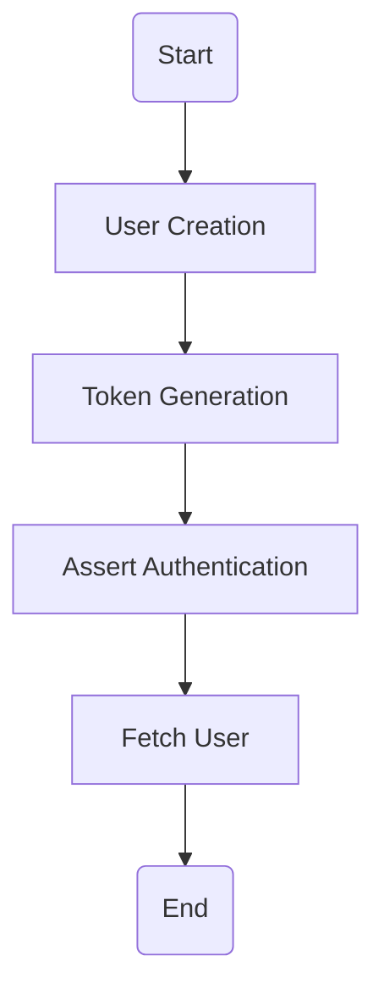
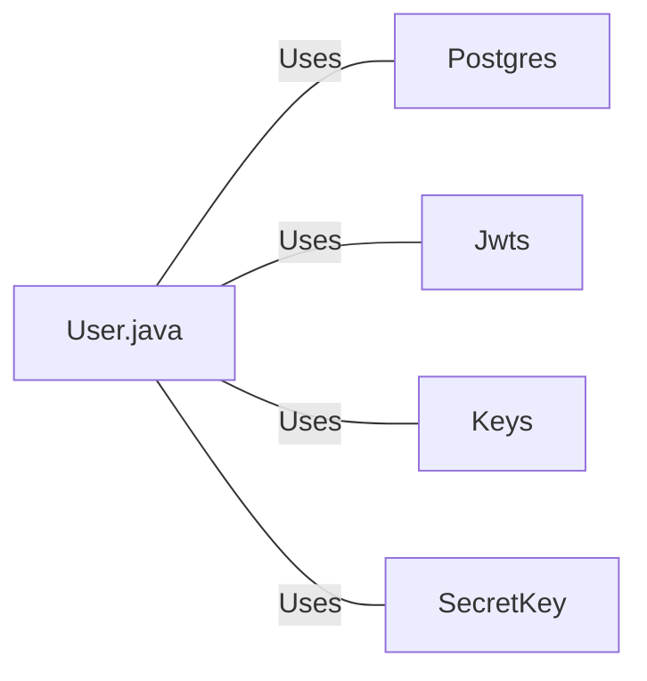

# User.java: User Authentication and Management

## Overview
The `User.java` class is responsible for user authentication and management. It provides functionalities for creating a user, generating a token for a user, asserting user authentication, and fetching user details from the database.

## Process Flow

## Insights
- The `User` class has three attributes: `id`, `username`, and `hashedPassword`.
- The `token` method generates a JWT token for a user.
- The `assertAuth` method validates the provided token.
- The `fetch` method retrieves a user from the database based on the username.

## Dependencies

- `Postgres` : The `Postgres` class is used to establish a connection with the PostgreSQL database. The `User` class uses this connection to execute SQL queries.
- `Jwts` : The `Jwts` class is used to build and parse JWT tokens. The `User` class uses this to generate and validate tokens.
- `Keys` : The `Keys` class is used to generate a `SecretKey` for signing the JWT token.
- `SecretKey` : The `SecretKey` class is used to hold the key for signing the JWT token.

## Data Manipulation (SQL)

- `users`: The `fetch` method executes a `SELECT` query on the `users` table to retrieve a user based on the username. The query retrieves the `user_id`, `username`, and `password` of the user.
