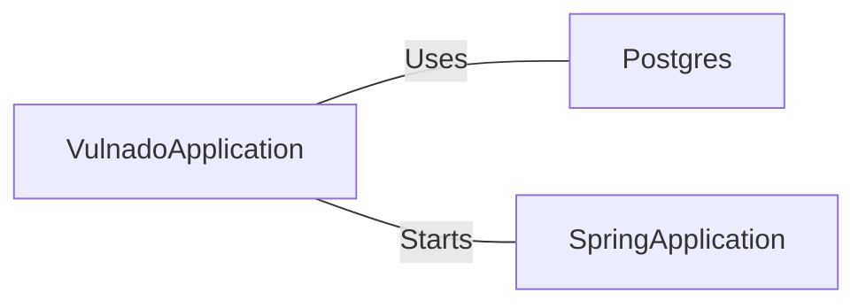

# VulnadoApplication.java: Main Application Entry Point

## Overview
The `VulnadoApplication.java` is the main entry point of the application. It is responsible for setting up the Postgres database and starting the Spring Application.

## Process Flow
```mermaid
graph TD
    Start("Start") --> Postgres_Setup{Postgres.setup()}
    Postgres_Setup --> SpringApplication_Run{SpringApplication.run(VulnadoApplication.class, args)}
    SpringApplication_Run --> End("End")
```

## Insights
- The `VulnadoApplication` class is annotated with `@SpringBootApplication`, which is a convenience annotation that adds all of the following:
  - `@Configuration`: Tags the class as a source of bean definitions for the application context.
  - `@EnableAutoConfiguration`: Tells Spring Boot to start adding beans based on classpath settings, other beans, and various property settings.
  - `@ComponentScan`: Tells Spring to look for other components, configurations, and services in the `com.scalesec.vulnado` package.
- The `@ServletComponentScan` annotation is used to enable the scanning of Servlet components.
- The `main` method is the entry point of the application. It first sets up the Postgres database by calling `Postgres.setup()`, and then starts the Spring Application by calling `SpringApplication.run(VulnadoApplication.class, args)`.

## Dependencies

- `Postgres` : The `Postgres` class is used to setup the Postgres database. The `setup` method is called without any parameters.
- `SpringApplication` : The `SpringApplication` class is used to bootstrap and launch the Spring application from a Java main method. The `run` method is called with `VulnadoApplication.class` and `args` as parameters.
