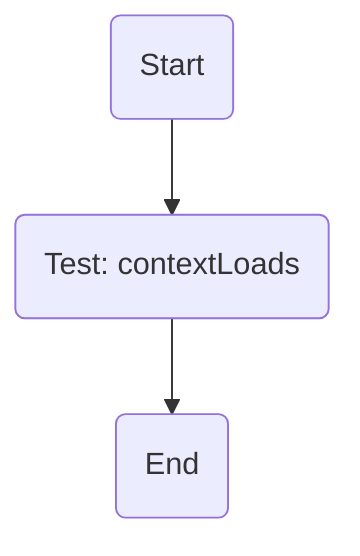
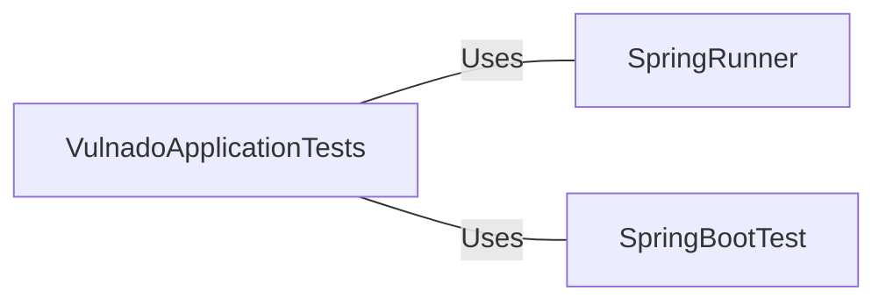

# VulnadoApplicationTests.java: Unit Test for Vulnado Application

## Overview
This file contains a unit test for the Vulnado application. It is designed to ensure that the application context loads correctly.

## Process Flow

The process flow of this unit test is straightforward. It begins with the start of the test, followed by the execution of the `contextLoads` test, and ends when the test is complete.

## Insights
- The `contextLoads` test is a simple test that checks if the Spring application context loads correctly. It does not perform any assertions.
- The `@RunWith(SpringRunner.class)` annotation is used to provide a bridge between Spring Boot test features and JUnit. This allows the test to leverage the features of both.
- The `@SpringBootTest` annotation is used to indicate that the context should be a `SpringApplication` context. This means that all the normal features of a Spring Boot application will be available during the test.

## Dependencies

- `SpringRunner` : Provides a bridge between Spring Boot test features and JUnit. It is used as a parameter to the `@RunWith` annotation.
- `SpringBootTest` : Indicates that the context should be a `SpringApplication` context. It is used as an annotation on the test class.
