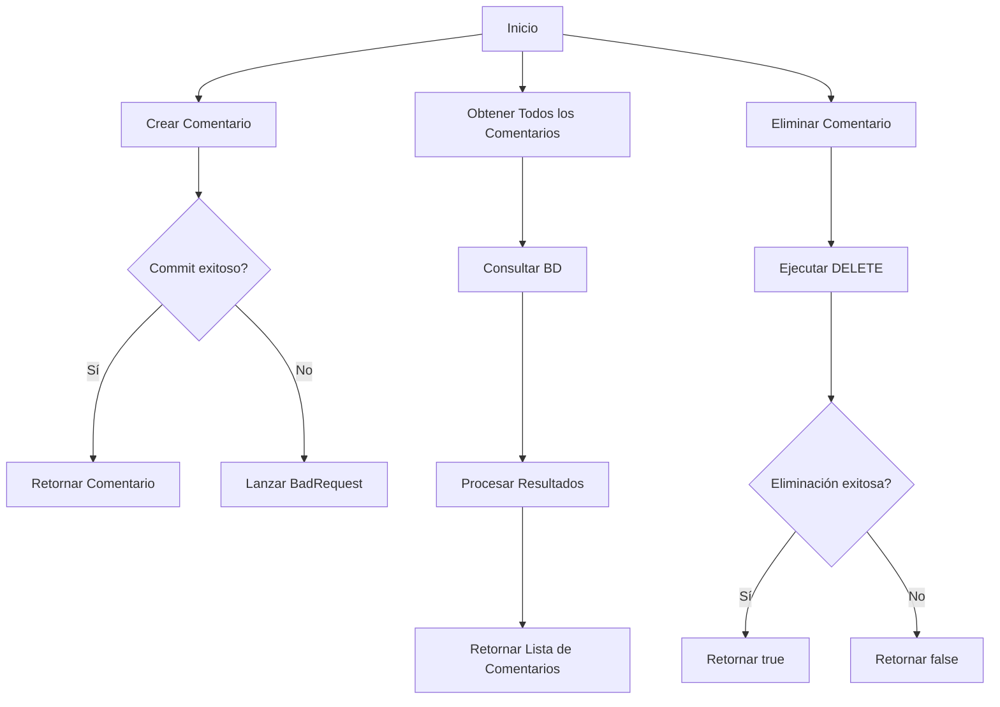
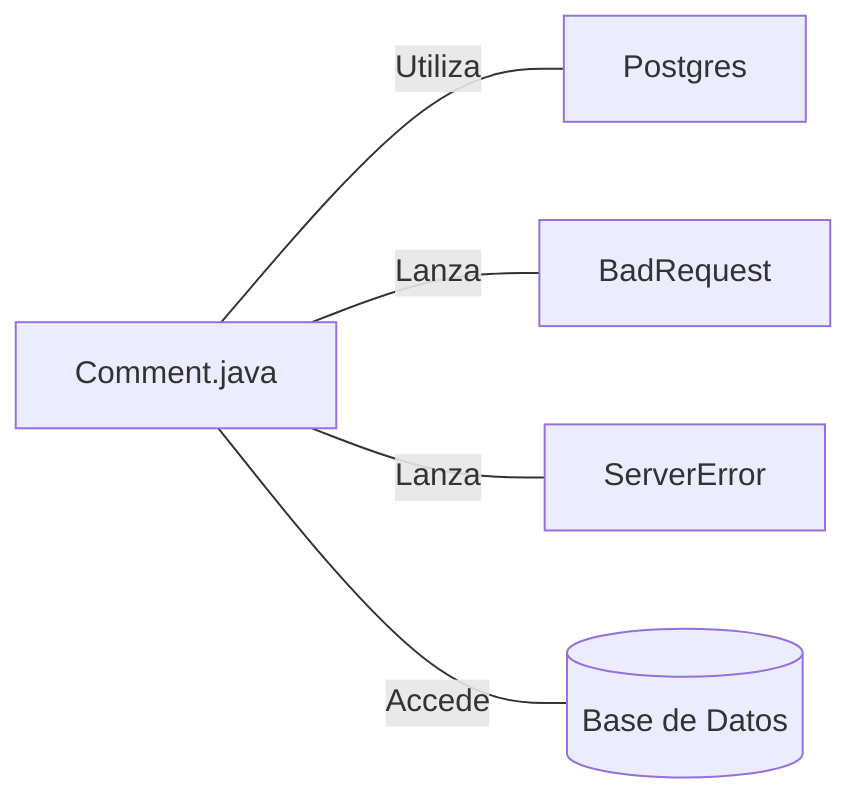

# Comment.java: Gestión de Comentarios

## Resumen

Esta clase maneja la creación, recuperación y eliminación de comentarios en una base de datos PostgreSQL. Proporciona funcionalidades para crear nuevos comentarios, obtener todos los comentarios existentes y eliminar comentarios específicos.

## Flujo del Proceso

## Insights

- Utiliza UUID para generar identificadores únicos para los comentarios.
- Implementa manejo de excepciones para operaciones de base de datos.
- Usa PreparedStatements para prevenir inyecciones SQL en operaciones de inserción y eliminación.
- La clase incluye métodos estáticos para operaciones CRUD (Crear, Leer, Eliminar).
- Se han realizado mejoras en el manejo de conexiones y recursos de base de datos.

## Dependencias

- `Postgres`: Utilizado para establecer conexiones con la base de datos PostgreSQL.
- `BadRequest`: Excepción lanzada cuando no se puede guardar un comentario.
- `ServerError`: Excepción lanzada para errores generales del servidor.
- `Base de Datos`: Almacena y recupera los datos de los comentarios.

## Manipulación de Datos (SQL)

| Entidad   | Descripción                                                                           |
|-----------|--------------------------------------------------------------------------------------|
| comments  | Tabla que almacena los comentarios con campos id, username, body y created_on         |

- `SELECT`: Recupera todos los comentarios de la tabla comments.
- `DELETE`: Elimina un comentario específico basado en su id.
- `INSERT`: Inserta un nuevo comentario con id, username, body y created_on en la tabla comments.
