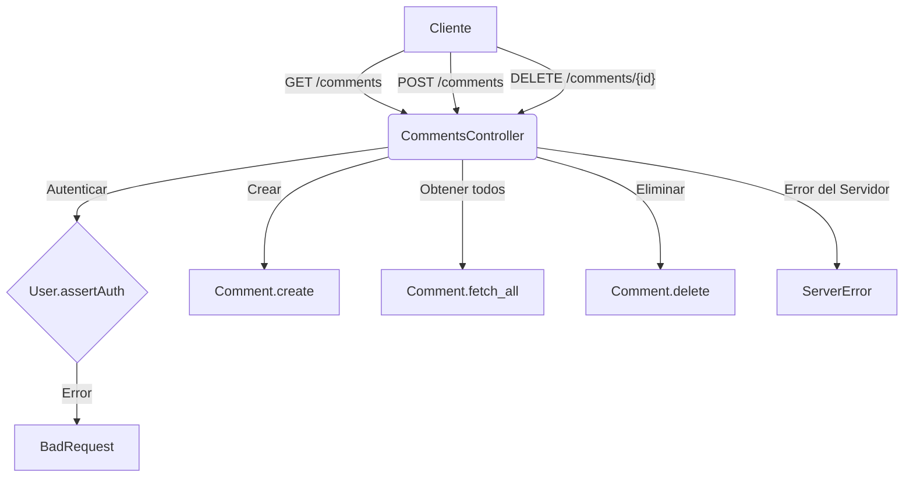
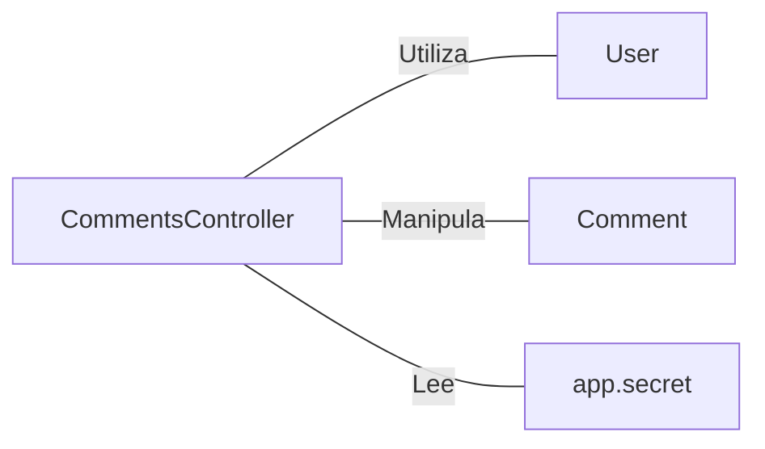

# CommentsController.java: Controlador de Comentarios para API REST

## Resumen

Este archivo define un controlador REST para manejar operaciones CRUD (Crear, Leer, Eliminar) de comentarios, utilizando Spring Boot. También incluye clases auxiliares para manejar solicitudes de comentarios y errores.

## Flujo del Proceso

## Insights

- Utiliza anotaciones de Spring Boot para definir endpoints REST.
- Implementa CORS (Cross-Origin Resource Sharing) para todos los orígenes.
- La autenticación se realiza mediante un token en el encabezado 'x-auth-token'.
- Las operaciones de comentarios (crear, obtener todos, eliminar) se delegan a la clase Comment.
- Maneja errores de solicitud incorrecta (400) y errores del servidor (500).

## Dependencias

- `User`: Utilizado para autenticar solicitudes.
- `Comment`: Clase que maneja las operaciones CRUD de comentarios.
- `app.secret`: Valor de configuración utilizado para la autenticación.

## Manipulación de Datos (SQL)

| Entidad   | Operación | Descripción                                    |
|-----------|-----------|------------------------------------------------|
| Comment   | SELECT    | Obtiene todos los comentarios (fetch_all)      |
| Comment   | INSERT    | Crea un nuevo comentario (create)              |
| Comment   | DELETE    | Elimina un comentario por ID (delete)          |

## Estructura de Datos

### CommentRequest

| Atributo | Tipo   | Descripción                    |
|----------|--------|--------------------------------|
| username | String | Nombre de usuario del comentario |
| body     | String | Contenido del comentario       |

