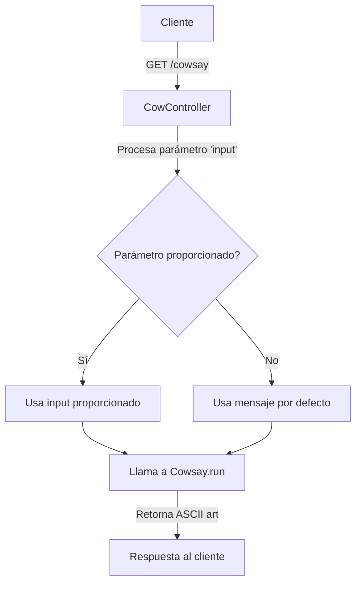
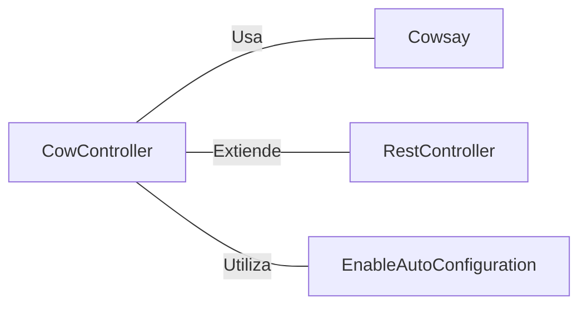

# CowController.java: Controlador REST para el servicio Cowsay

## Overview

CowController es un controlador REST que maneja las solicitudes para el servicio Cowsay, permitiendo a los usuarios generar mensajes de texto con una representación ASCII de una vaca.

## Process Flow

## Insights

- Utiliza Spring Boot para la configuración automática y la creación de endpoints REST.
- Implementa un único endpoint `/cowsay` que acepta un parámetro de consulta opcional `input`.
- Si no se proporciona un input, utiliza un mensaje predeterminado "I love Linux!".
- Delega la generación del ASCII art a una clase externa `Cowsay`.

## Dependencies

- `Cowsay`: Clase utilizada para generar el ASCII art de la vaca con el mensaje proporcionado.
- `RestController`: Anotación de Spring que marca la clase como un controlador REST.
- `EnableAutoConfiguration`: Anotación de Spring Boot que habilita la configuración automática.

## Data Manipulation (SQL)

Esta sección no es aplicable ya que el código no realiza manipulación directa de datos SQL.
