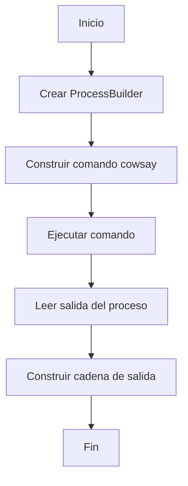
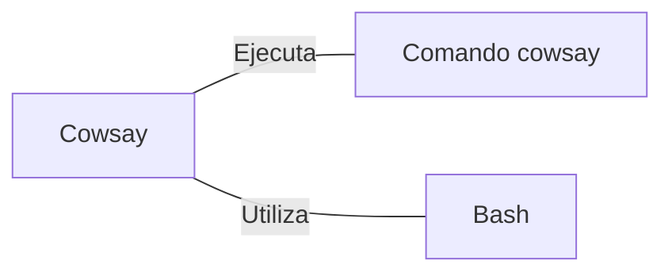

# Cowsay.java: Generador de ASCII Art con Cowsay

## Descripción general

Este programa Java utiliza el comando `cowsay` de Unix para generar ASCII art basado en la entrada del usuario. Ejecuta el comando `cowsay` como un proceso externo y captura su salida.

## Flujo del proceso

## Insights

- Utiliza `ProcessBuilder` para ejecutar comandos del sistema.
- La entrada del usuario se inserta directamente en el comando, lo que podría presentar riesgos de seguridad.
- Captura la salida del proceso utilizando `BufferedReader`.
- Maneja excepciones pero solo las imprime en la consola.

## Dependencias

- `cowsay_command`: Ejecuta el comando `/usr/games/cowsay` con la entrada proporcionada.
- `bash`: Utiliza el intérprete de comandos Bash para ejecutar el comando.

## Manipulación de datos (SQL)

Esta sección no es aplicable ya que el código no realiza operaciones de base de datos.
