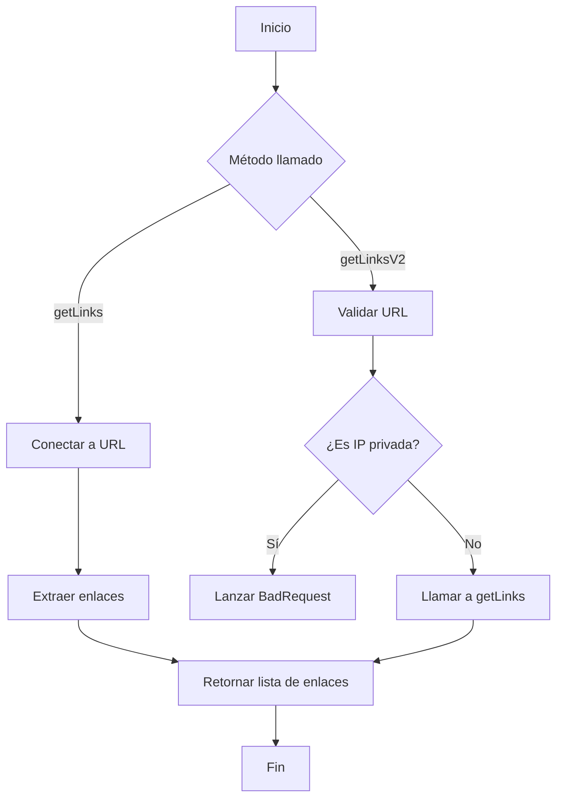
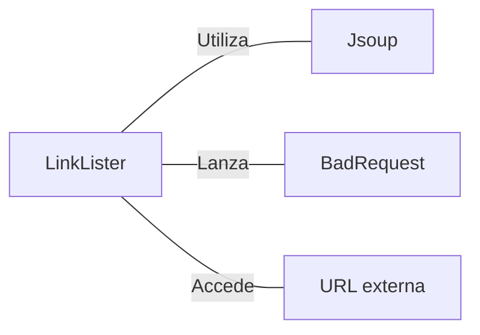

# LinkLister.java: Extractor de Enlaces Web

## Resumen

LinkLister es una clase Java que proporciona funcionalidad para extraer enlaces de una página web dada. Ofrece dos métodos principales: uno básico para obtener enlaces y otro con validación adicional de direcciones IP privadas.

## Flujo del Proceso

## Insights

- Utiliza la biblioteca Jsoup para el análisis HTML y la extracción de enlaces.
- Implementa validación de IP privadas en `getLinksV2` para prevenir accesos no autorizados.
- Maneja excepciones y las convierte en `BadRequest` en `getLinksV2`.
- Los enlaces extraídos se devuelven como URLs absolutas.

## Dependencias

- `Jsoup`: Biblioteca utilizada para conectar y analizar páginas web HTML.
- `BadRequest`: Excepción personalizada lanzada en caso de errores o uso de IP privadas.
- `URL externa`: La URL proporcionada como entrada para extraer enlaces.

## Manipulación de Datos (SQL)

| Atributo | Tipo    | Descripción                                   |
|----------|---------|-----------------------------------------------|
| url      | String  | URL de la página web de la que extraer enlaces |
| result   | List<String> | Lista de enlaces extraídos de la página web  |
