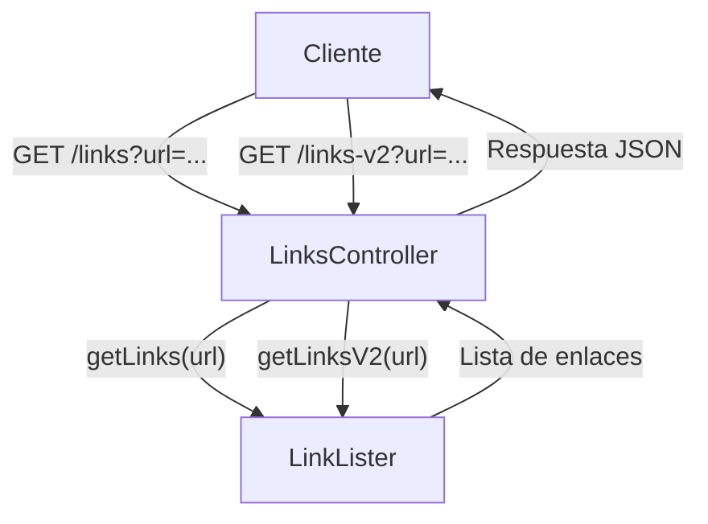
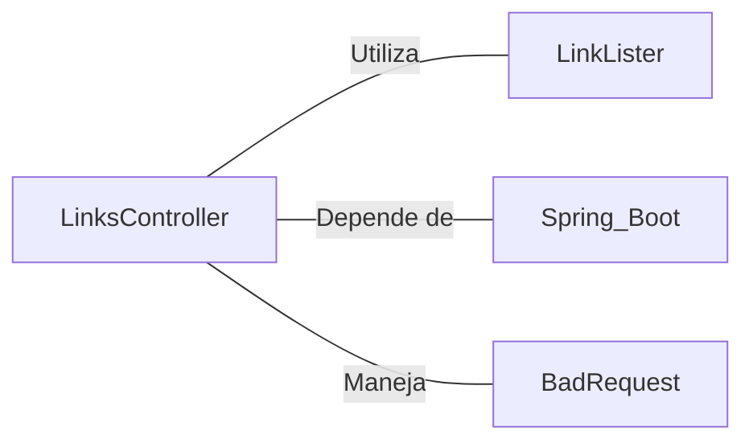

# LinksController.java: Controlador REST para Listar Enlaces

## Overview

Este controlador REST proporciona endpoints para listar enlaces de una URL dada, ofreciendo dos versiones de la funcionalidad.

## Process Flow

## Insights

- Utiliza Spring Boot para la configuración automática y la creación de endpoints REST.
- Ofrece dos versiones del endpoint para listar enlaces: `/links` y `/links-v2`.
- Maneja diferentes tipos de excepciones para cada versión del endpoint.
- Produce respuestas en formato JSON.

## Dependencies

- `LinkLister`: Clase utilizada para obtener los enlaces de una URL dada.
- `Spring Boot`: Framework utilizado para la configuración y creación de la aplicación REST.
- `BadRequest`: Excepción personalizada manejada en la versión 2 del endpoint.

## Data Manipulation (SQL)

Esta sección no es aplicable ya que el código no realiza manipulación directa de datos SQL.
