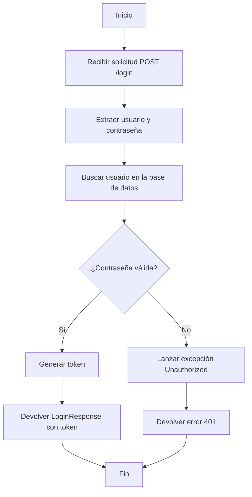
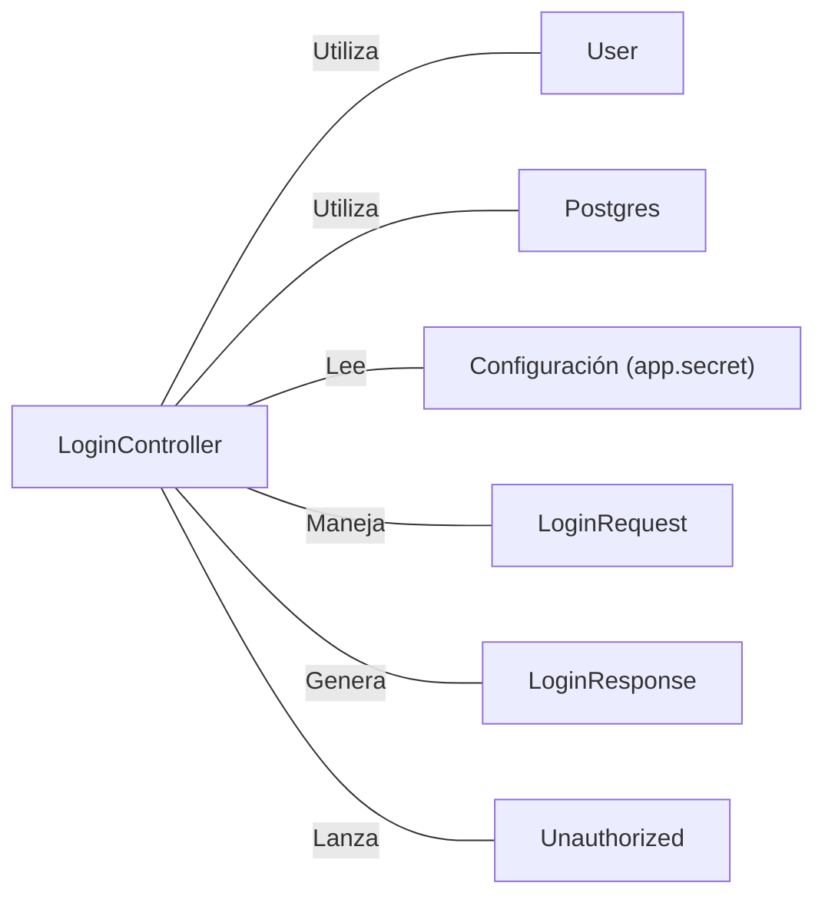

# LoginController.java: Controlador de Autenticación de Usuarios

## Resumen

Este archivo contiene un controlador REST para manejar la autenticación de usuarios, implementando un endpoint de inicio de sesión que valida las credenciales del usuario y genera un token de acceso.

## Flujo del Proceso

## Insights

- Utiliza Spring Boot para la configuración automática y la creación de endpoints REST.
- Implementa autenticación basada en tokens.
- Permite solicitudes de origen cruzado (CORS) para todos los orígenes.
- Utiliza hashing MD5 para la verificación de contraseñas, lo cual no es considerado seguro en la actualidad.
- El secreto de la aplicación se inyecta desde la configuración externa.

## Dependencias

- `User`: Clase que representa un usuario y proporciona métodos para recuperar información del usuario y generar tokens.
- `Postgres`: Clase que proporciona funcionalidad de hashing MD5 para contraseñas.
- `app.secret`: Configuración externa que proporciona un secreto para la generación de tokens.
- `LoginRequest`: Clase que representa la estructura de la solicitud de inicio de sesión.
- `LoginResponse`: Clase que representa la estructura de la respuesta de inicio de sesión.
- `Unauthorized`: Excepción personalizada para manejar errores de autenticación.

## Manipulación de Datos (SQL)

| Entidad | Atributos | Tipo | Descripción |
|---------|-----------|------|-------------|
| User    | username  | String | Nombre de usuario |
|         | hashedPassword | String | Contraseña hasheada (MD5) |

- `User`: SELECT implícito a través del método `User.fetch(username)` para recuperar la información del usuario.
