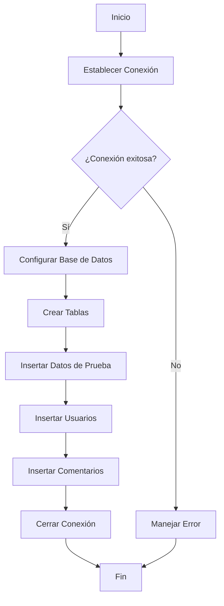
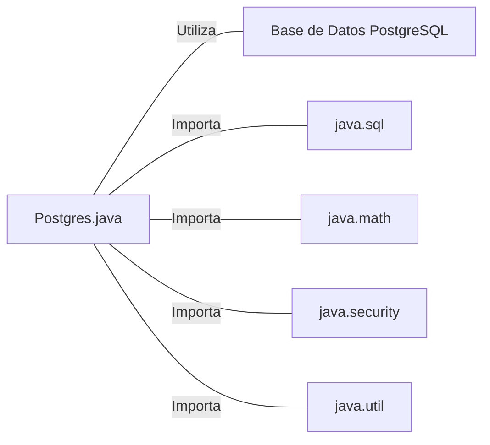

# Postgres.java: Gestor de Conexión y Operaciones de Base de Datos PostgreSQL

## Resumen

Esta clase proporciona funcionalidades para establecer conexiones con una base de datos PostgreSQL, configurar el esquema inicial, y realizar operaciones básicas de inserción de usuarios y comentarios.

## Flujo del Proceso

## Insights

- Utiliza variables de entorno para la configuración de la base de datos, mejorando la seguridad y flexibilidad.
- Implementa un método de hash MD5 para el almacenamiento de contraseñas, aunque MD5 no se considera seguro para este propósito en la actualidad.
- Incluye manejo de excepciones y cierre de recursos en bloques finally para mejorar la robustez.
- Utiliza PreparedStatements para las inserciones, lo que ayuda a prevenir inyecciones SQL.
- Genera UUIDs para los identificadores de usuarios y comentarios.

## Dependencias

- `PostgreSQL`: Base de datos utilizada para almacenar usuarios y comentarios.
- `java.sql`: Proporciona clases para la conexión y manipulación de bases de datos.
- `java.math`: Utilizada para operaciones matemáticas de precisión arbitraria (BigInteger).
- `java.security`: Proporciona clases e interfaces para funciones de seguridad y criptografía.
- `java.util`: Utilizada para generar UUIDs.

## Manipulación de Datos (SQL)

| Entidad   | Atributos                                                   | Descripción                                |
|-----------|-------------------------------------------------------------|-------------------------------------------|
| users     | user_id, username, password, created_on, last_login         | Almacena información de usuarios           |
| comments  | id, username, body, created_on                              | Almacena comentarios de usuarios           |

- `users`: CREATE TABLE para crear la tabla de usuarios con campos para ID, nombre de usuario, contraseña y marcas de tiempo.
- `comments`: CREATE TABLE para crear la tabla de comentarios con campos para ID, nombre de usuario, contenido y marca de tiempo.
- `users`: DELETE para limpiar datos existentes antes de insertar nuevos registros.
- `comments`: DELETE para limpiar datos existentes antes de insertar nuevos registros.
- `users`: INSERT para agregar nuevos usuarios con contraseñas hasheadas.
- `comments`: INSERT para agregar nuevos comentarios asociados a usuarios.
