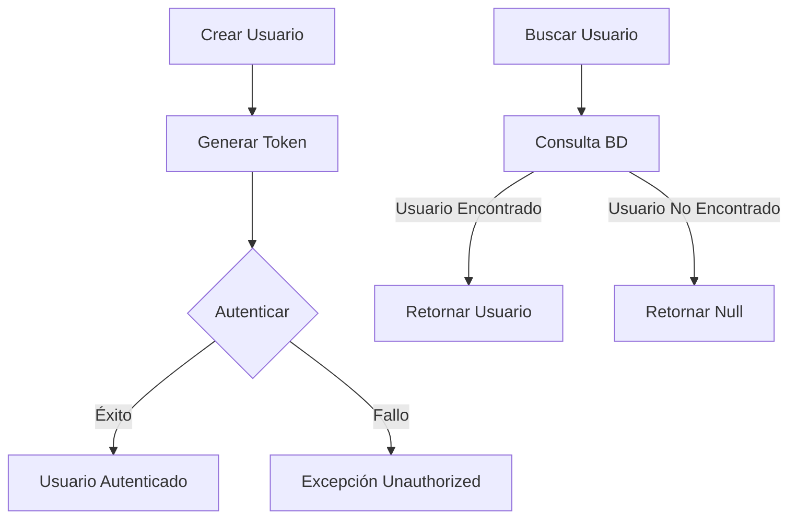
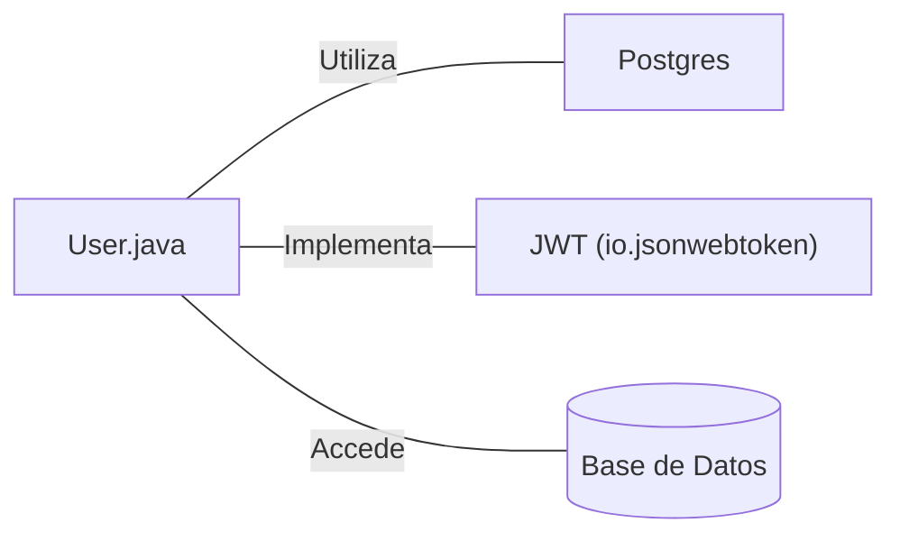

# User.java: Gestión de Usuarios y Autenticación

## Resumen

Esta clase maneja la autenticación de usuarios, la generación de tokens JWT y la recuperación de información de usuarios desde una base de datos PostgreSQL.

## Flujo del Proceso

## Insights

- Utiliza JWT (JSON Web Tokens) para la autenticación.
- La consulta SQL para buscar usuarios es vulnerable a inyección SQL.
- Maneja conexiones a base de datos PostgreSQL.
- Incluye manejo básico de errores y cierre de recursos de base de datos.

## Dependencias

- `Postgres`: Utilizado para establecer conexiones con la base de datos PostgreSQL.
- `JWT (io.jsonwebtoken)`: Librería utilizada para la generación y validación de tokens JWT.
- `Base de Datos`: Almacena información de usuarios y se accede mediante consultas SQL.

## Manipulación de Datos (SQL)

| Entidad | Atributos | Tipo | Descripción |
|---------|-----------|------|-------------|
| users   | user_id   | String | Identificador único del usuario |
|         | username  | String | Nombre de usuario |
|         | password  | String | Contraseña hasheada del usuario |

`users`: SELECT para obtener información del usuario basado en el nombre de usuario.
