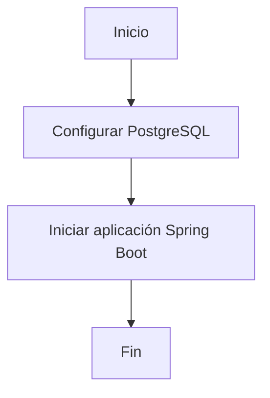
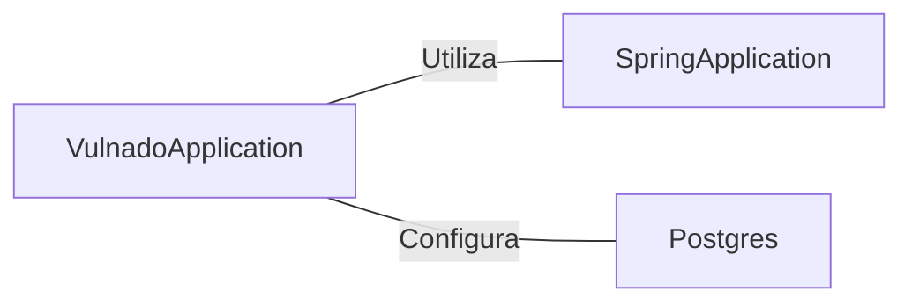

# VulnadoApplication.java: Aplicación Spring Boot con Configuración de Servlet y Base de Datos

## Descripción general

VulnadoApplication es la clase principal de una aplicación Spring Boot que configura el escaneo de componentes de servlet y realiza la configuración inicial de la base de datos PostgreSQL antes de iniciar la aplicación.

## Flujo del proceso

## Insights

- Utiliza la anotación `@ServletComponentScan` para habilitar el escaneo de componentes de servlet.
- Implementa `@SpringBootApplication` para configurar automáticamente la aplicación Spring Boot.
- Realiza la configuración de PostgreSQL antes de iniciar la aplicación Spring.

## Dependencias

- `SpringApplication`: Utilizado para iniciar la aplicación Spring Boot.
- `Postgres`: Clase utilizada para configurar la base de datos PostgreSQL antes de iniciar la aplicación.
