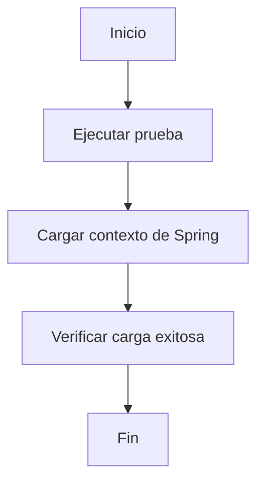
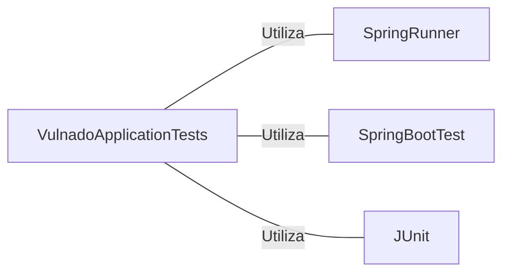

# VulnadoApplicationTests.java: Prueba de Carga de Contexto de la Aplicación Vulnado

## Descripción General

Esta clase de prueba verifica la carga correcta del contexto de la aplicación Spring Boot para el proyecto Vulnado.

## Flujo del Proceso

## Insights

- Utiliza JUnit para ejecutar pruebas unitarias
- Implementa el marco de pruebas de Spring Boot
- La prueba `contextLoads()` verifica que el contexto de la aplicación se cargue correctamente
- No contiene aserciones explícitas, confiando en que Spring Boot lanzará una excepción si hay problemas de carga del contexto

## Dependencias

- `SpringRunner`: Utilizado como ejecutor de pruebas para integrar JUnit con el contexto de Spring
- `SpringBootTest`: Proporciona la anotación para configurar la prueba de integración de Spring Boot
- `JUnit`: Marco de pruebas utilizado para definir y ejecutar la prueba
