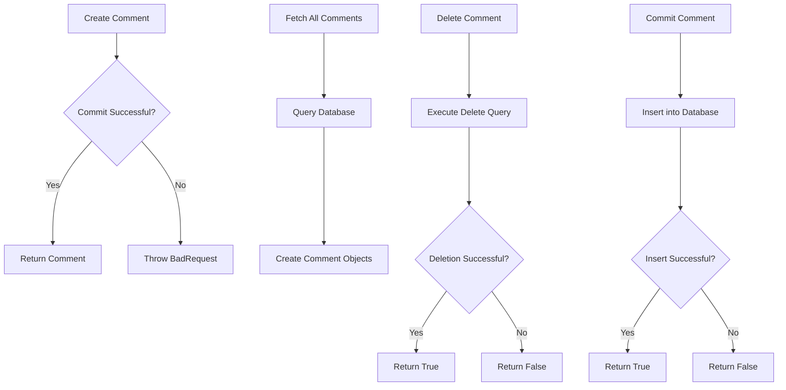
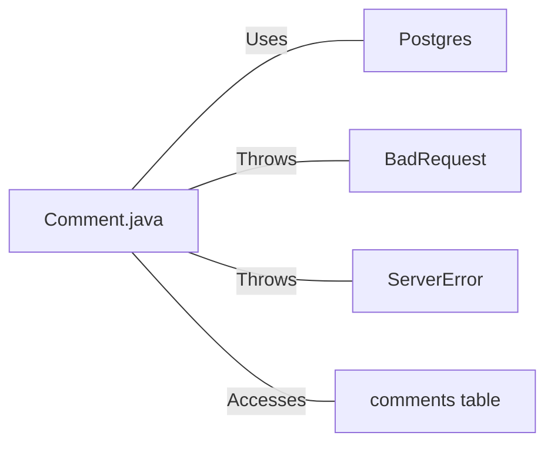

# Comment.java: Comment Management System

## Overview

This Java class, `Comment`, manages comment-related operations including creation, retrieval, deletion, and persistence of comments in a database.

## Process Flow

## Insights

- Uses UUID for generating unique comment IDs
- Implements CRUD operations (Create, Read, Delete) for comments
- Utilizes prepared statements for database operations, enhancing security
- Implements proper resource management with try-finally blocks for database connections and statements
- Includes error handling and custom exceptions (BadRequest, ServerError)

## Dependencies

- `Postgres`: Used for database connection management
- `BadRequest`: Custom exception thrown when unable to save a comment
- `ServerError`: Custom exception thrown for general server errors
- `comments`: Database table accessed for storing and retrieving comment data

## Data Manipulation (SQL)

| Entity    | Description                                                           |
|-----------|-----------------------------------------------------------------------|
| comments  | SELECT: Retrieves all comments from the database                      |
| comments  | DELETE: Removes a specific comment based on its ID                    |
| comments  | INSERT: Adds a new comment with id, username, body, and creation time |
