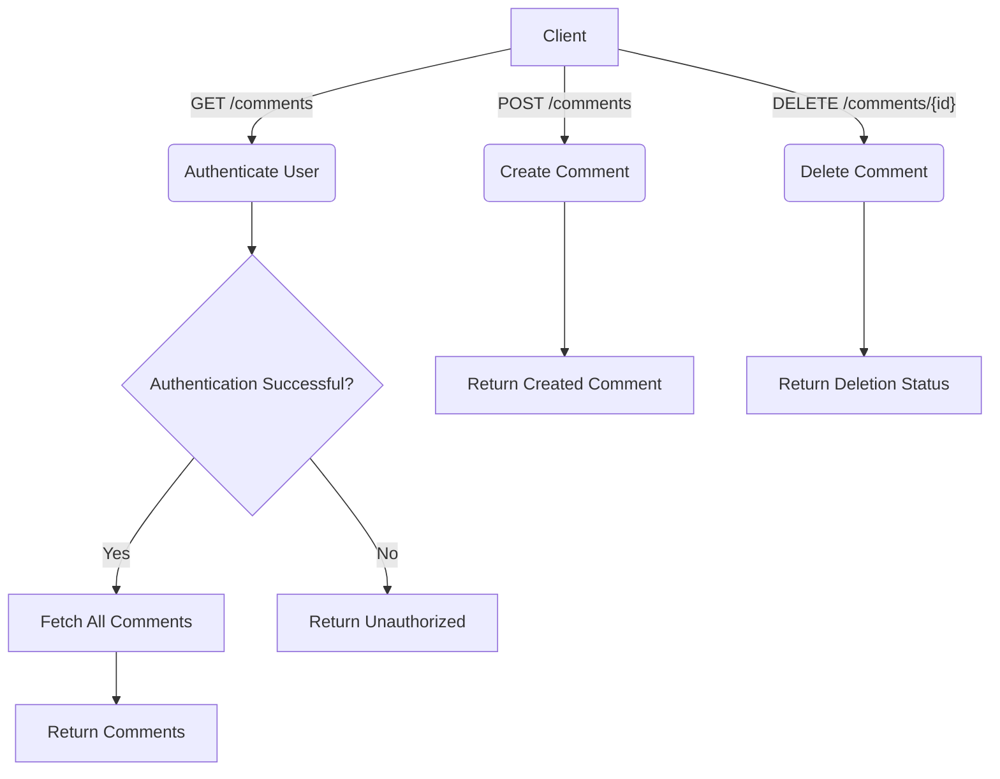
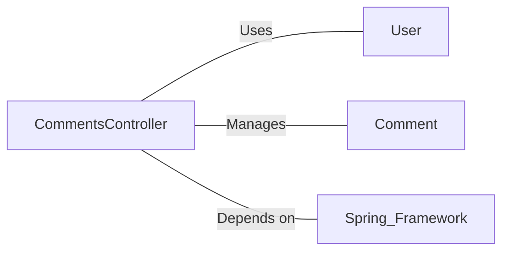

# CommentsController.java: RESTful API for Comment Management

## Overview

This Java file defines a RESTful API controller for managing comments, including endpoints for fetching, creating, and deleting comments. It also includes cross-origin resource sharing (CORS) configuration and authentication checks.

## Process Flow

## Insights

- The controller uses Spring Boot's auto-configuration feature.
- CORS is enabled for all origins on all endpoints.
- Authentication is required for accessing comments, but not for creating or deleting them.
- The application secret is injected via the `@Value` annotation.
- Custom exception classes are defined for handling bad requests and server errors.

## Dependencies

- `User`: Used for authentication in the `comments` method
- `Comment`: Manages comment-related operations (fetch_all, create, delete)
- `Spring Framework`: Provides annotations and functionality for RESTful API development

## Data Manipulation (SQL)

| Entity    | Attributes | Type   | Description                    |
|-----------|------------|--------|--------------------------------|
| Comment   | id         | String | Unique identifier for comment  |
|           | username   | String | User who created the comment   |
|           | body       | String | Content of the comment         |

- `Comment.fetch_all()`: Retrieves all comments from the data store
- `Comment.create(username, body)`: Creates a new comment with the given username and body
- `Comment.delete(id)`: Deletes the comment with the specified id
