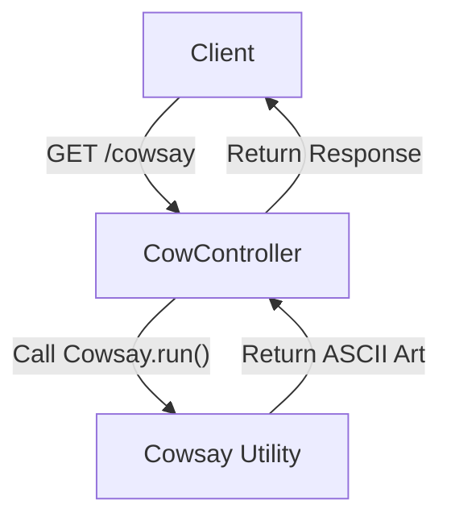
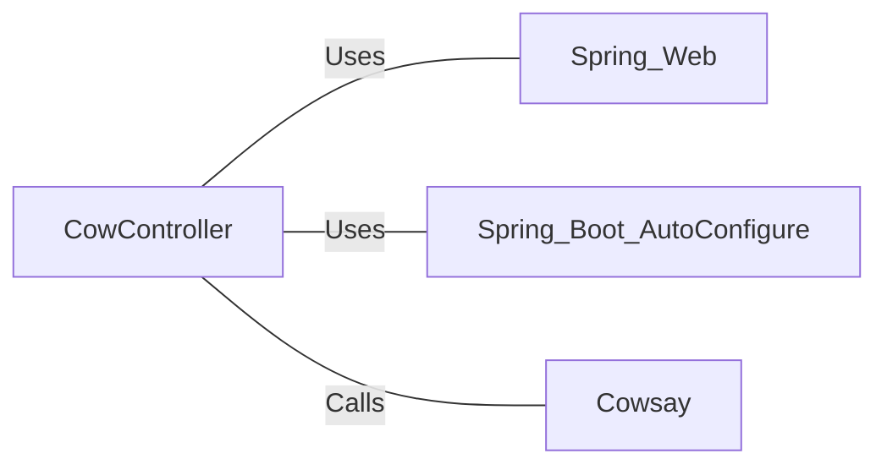

# CowController.java: Cowsay REST API Endpoint

## Overview

CowController is a Spring Boot REST controller that provides an endpoint for generating Cowsay messages. It utilizes the Cowsay utility to create ASCII art cow images with customizable text.

## Process Flow

## Insights

- Implements a single REST endpoint `/cowsay`
- Uses Spring Boot's auto-configuration feature
- Accepts an optional `input` parameter with a default value of "I love Linux!"
- Delegates the Cowsay generation to a separate `Cowsay` class

## Dependencies

- `Spring Web`: Provides REST controller functionality
- `Spring Boot AutoConfigure`: Enables automatic configuration of the Spring application
- `Cowsay`: Utility class for generating Cowsay ASCII art (not shown in the provided code snippet)
