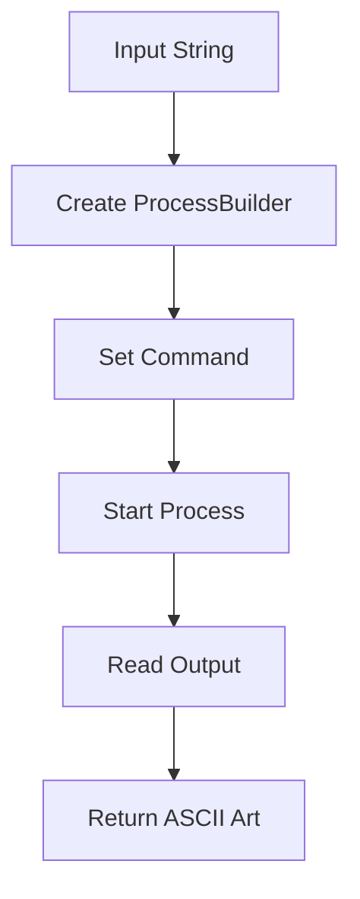
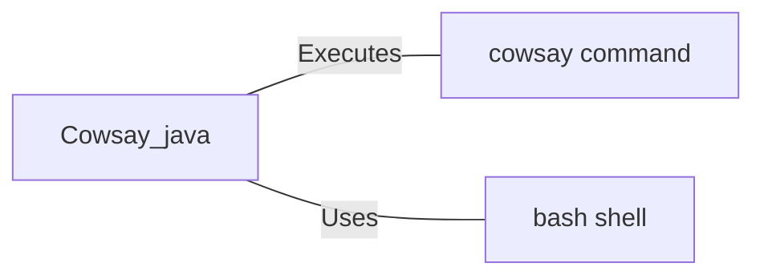

# Cowsay.java: ASCII Art Generator

## Overview

Cowsay.java is a Java program that interfaces with the Unix `cowsay` command to generate ASCII art. It takes a string input and returns the output of the `cowsay` command as a string.

## Process Flow

## Insights

- The program uses `ProcessBuilder` to execute shell commands from Java.
- It directly concatenates user input into the shell command, which could pose a security risk.
- The output is read line by line and accumulated in a `StringBuilder`.
- Exception handling is present, but it only prints the stack trace without proper error reporting.

## Dependencies

- `cowsay command`: Executed to generate ASCII art based on the provided input
- `bash shell`: Used to run the `cowsay` command

## Data Manipulation (SQL)

This section is not applicable as the program does not involve any SQL operations or data structures.
