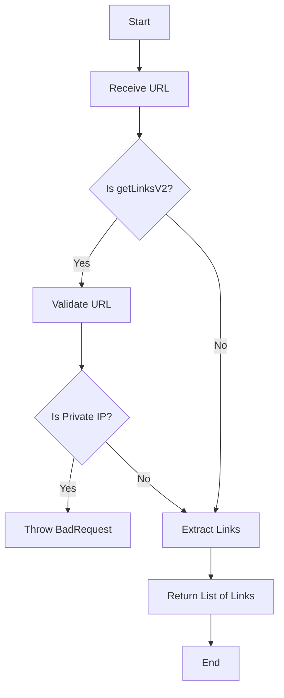
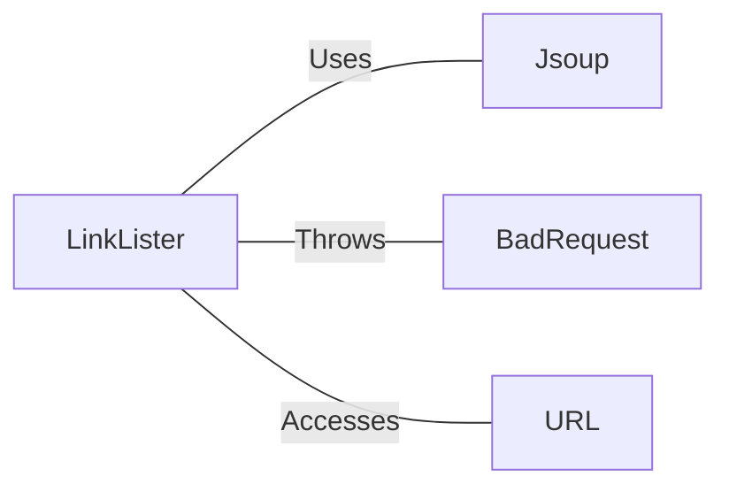

# LinkLister.java: Web Page Link Extractor

## Overview

LinkLister is a Java class that provides functionality to extract links from a given URL. It offers two methods: `getLinks` and `getLinksV2`, with the latter including additional security checks.

## Process Flow

## Insights

- Uses JSoup library for HTML parsing and link extraction
- Implements a security check in `getLinksV2` to prevent access to private IP addresses
- Handles exceptions and wraps them in a custom `BadRequest` exception
- Returns absolute URLs for extracted links

## Dependencies

- `Jsoup`: Used for connecting to URLs and parsing HTML content
- `BadRequest`: Custom exception class used for error handling
- `URL`: Java's built-in URL class used for URL parsing and validation

## Data Manipulation (SQL)

This section is not applicable as the code does not involve any SQL operations.
