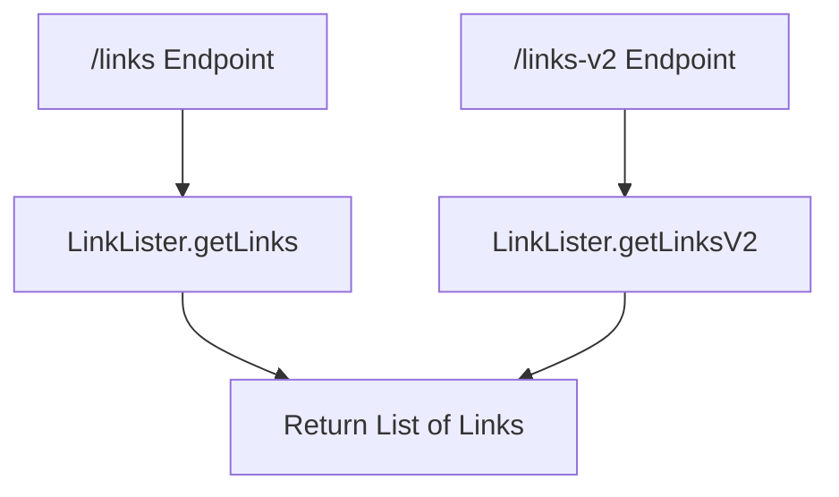
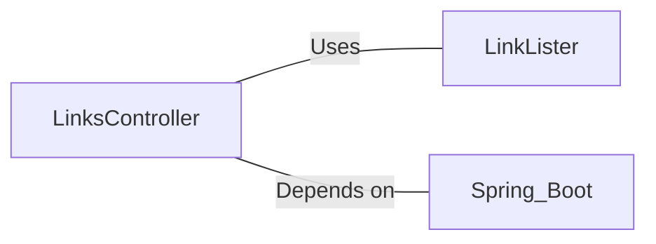

# LinksController.java: RESTful API for Link Retrieval

## Overview

LinksController is a Spring Boot REST controller that provides endpoints for retrieving links from a given URL.

## Process Flow

## Insights

- Utilizes Spring Boot's auto-configuration feature
- Provides two versions of the link retrieval endpoint
- Handles potential IOException and BadRequest exceptions
- Returns results as JSON

## Dependencies

- `LinkLister`: Provides methods for retrieving links from a given URL
- `Spring Boot`: Framework used for creating the RESTful API

## Data Manipulation (SQL)

This section is not applicable as the code does not involve any direct SQL operations or data structure declarations.
