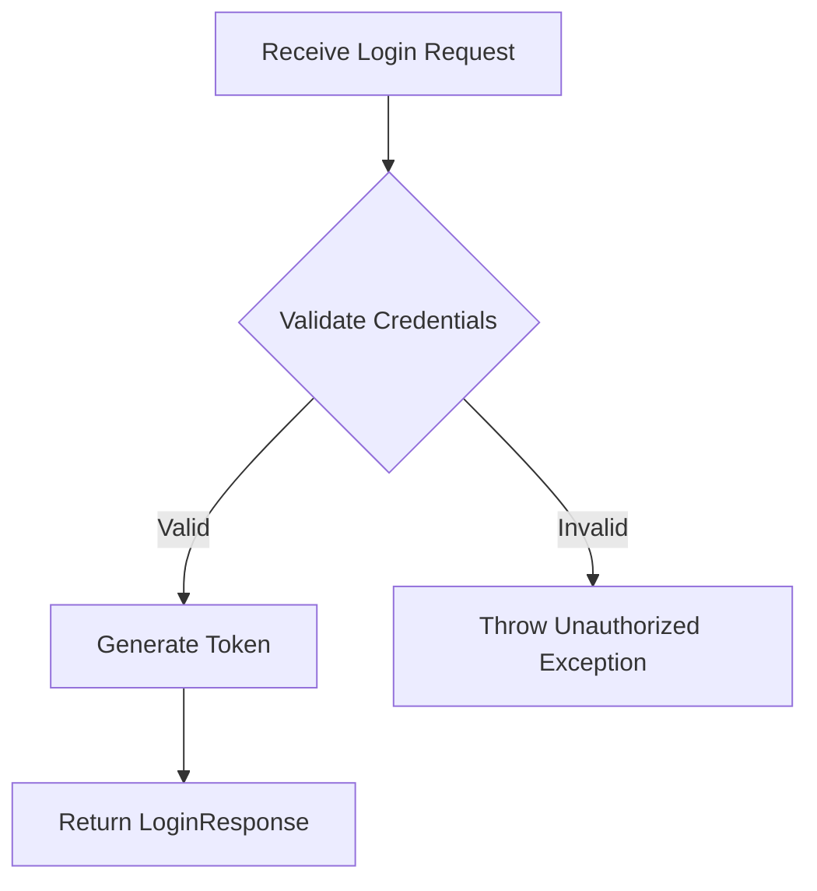
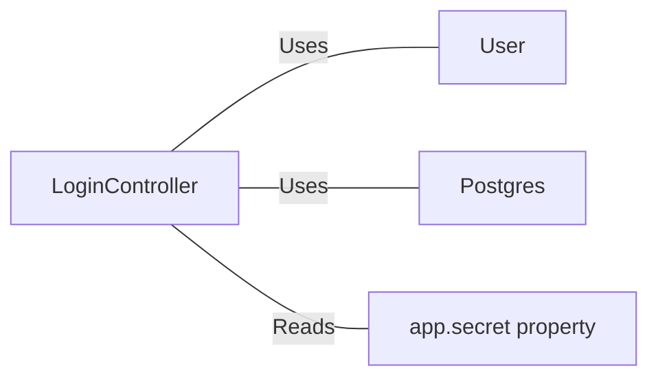

# LoginController.java: User Authentication Handler

## Overview

LoginController is a Spring Boot REST controller responsible for handling user authentication. It processes login requests, validates credentials, and generates authentication tokens for successful logins.

## Process Flow

## Insights

- Uses Spring Boot's `@RestController` and `@EnableAutoConfiguration` annotations for RESTful API setup
- Implements Cross-Origin Resource Sharing (CORS) with `@CrossOrigin(origins = "*")`
- Utilizes MD5 hashing for password verification (Note: MD5 is considered insecure for password hashing)
- Employs a secret key for token generation, loaded from application properties
- Throws a custom `Unauthorized` exception for failed authentication attempts

## Dependencies

- `User`: Fetches user data and generates authentication tokens
- `Postgres`: Provides MD5 hashing functionality
- `app.secret`: Application property used for token generation

## Data Manipulation (SQL)

| Entity | Attributes | Type | Description |
|--------|------------|------|-------------|
| LoginRequest | username | String | User's login identifier |
| | password | String | User's password for authentication |
| LoginResponse | token | String | Authentication token for successful login |
