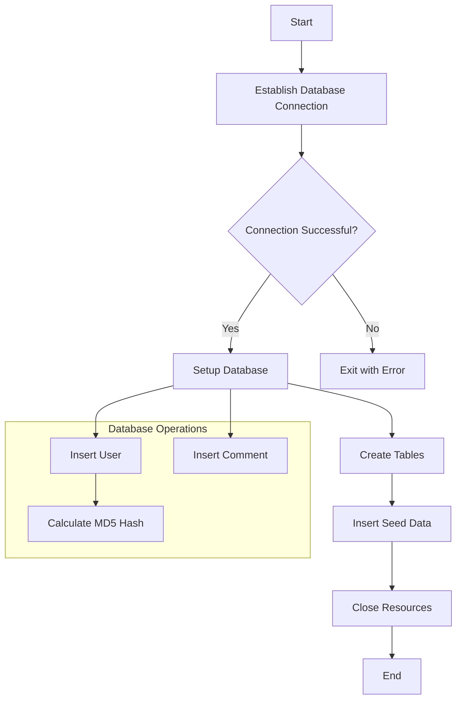
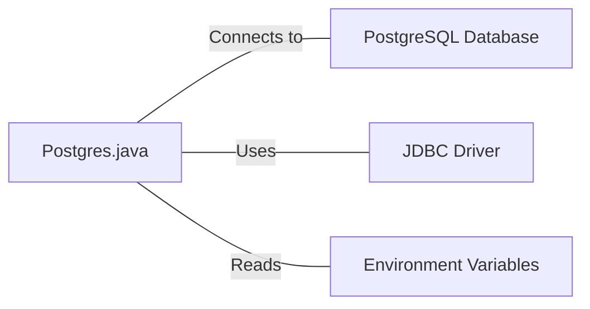

# Postgres.java: Database Connection and Setup Utility

## Overview

This Java class, `Postgres`, provides utility methods for establishing a connection to a PostgreSQL database, setting up the database schema, and performing basic operations such as inserting users and comments.

## Process Flow

## Insights

- The class uses environment variables for database connection details, enhancing security and flexibility.
- It implements a basic MD5 hashing function for password storage, which is not considered secure for modern applications.
- The setup method creates tables for users and comments if they don't exist, and inserts initial seed data.
- Prepared statements are used for database insertions, helping to prevent SQL injection.
- The class includes some error handling and resource management, but there's room for improvement in exception handling and resource closing.

## Dependencies

- `PostgreSQL Database`: The main database the application connects to and interacts with.
- `JDBC Driver`: Used for database connectivity (org.postgresql.Driver).
- `Environment Variables`: PGHOST, PGDATABASE, PGUSER, PGPASSWORD for database connection details.

## Data Manipulation (SQL)

### Table Structures

| Table Name | Columns | Data Type | Description |
|------------|---------|-----------|-------------|
| users | user_id | VARCHAR(36) | Primary Key |
|  | username | VARCHAR(50) | Unique, Not Null |
|  | password | VARCHAR(50) | Not Null |
|  | created_on | TIMESTAMP | Not Null |
|  | last_login | TIMESTAMP | |
| comments | id | VARCHAR(36) | Primary Key |
|  | username | VARCHAR(36) | |
|  | body | VARCHAR(500) | |
|  | created_on | TIMESTAMP | Not Null |

### SQL Operations

- `users`: CREATE TABLE, DELETE (clear existing data), INSERT (new users)
- `comments`: CREATE TABLE, DELETE (clear existing data), INSERT (new comments)
