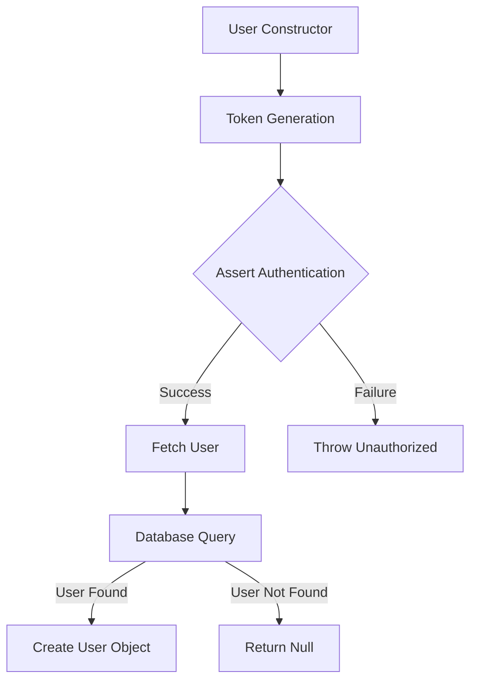
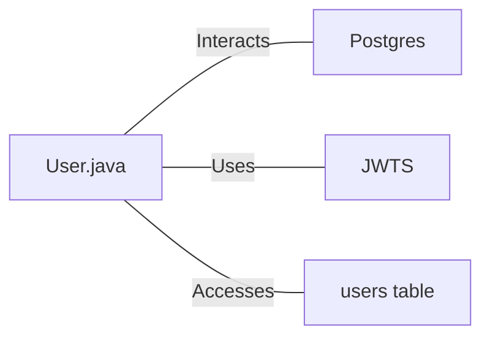

# User.java: User Authentication and Database Interaction

## Overview

This Java class, `User`, manages user authentication, token generation, and database interactions for user retrieval.

## Process Flow

## Insights

- The class uses JWT (JSON Web Tokens) for authentication.
- Database queries are constructed using string concatenation, which is vulnerable to SQL injection attacks.
- Exception handling is implemented, but some exceptions are only printed and not properly handled.
- The `fetch` method establishes a database connection for each query, which may not be efficient for high-frequency operations.
- The code includes comments indicating some modifications made by an AI bot, suggesting ongoing maintenance or improvements.

## Dependencies

- `Postgres`: Used to establish database connections
- `JWTS`: Utilized for JWT token generation and parsing
- `users table`: Database table accessed to fetch user information

## Data Manipulation (SQL)

| Entity | Operation | Description |
|--------|-----------|-------------|
| `users` | SELECT | Retrieves user information based on the provided username |

Table structure for `users`:

| Column | Type | Description |
|--------|------|-------------|
| user_id | String | Unique identifier for the user |
| username | String | User's username |
| password | String | User's hashed password |
