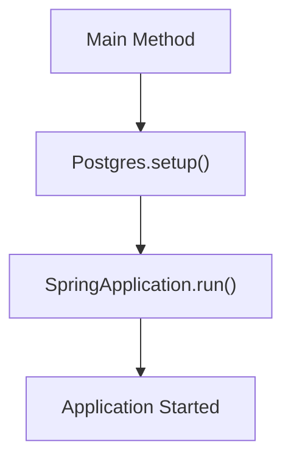
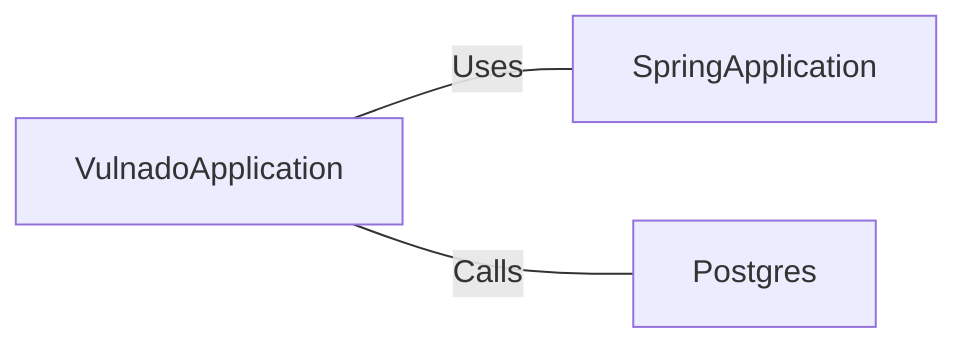

# VulnadoApplication.java: Spring Boot Application Initializer

## Overview

VulnadoApplication is the main class for initializing a Spring Boot application. It sets up the PostgreSQL database and launches the Spring application.

## Process Flow

## Insights

- Uses Spring Boot framework for application setup
- Initializes PostgreSQL database before starting the application
- Utilizes ServletComponentScan for automatic detection of servlet components

## Dependencies

- `SpringApplication`: Used to bootstrap and launch the Spring application
- `Postgres`: Custom class with a `setup()` method, likely for database initialization

## Data Manipulation (SQL)

- `Postgres.setup()`: Initializes the PostgreSQL database. Specific SQL operations are not visible in this code snippet.
