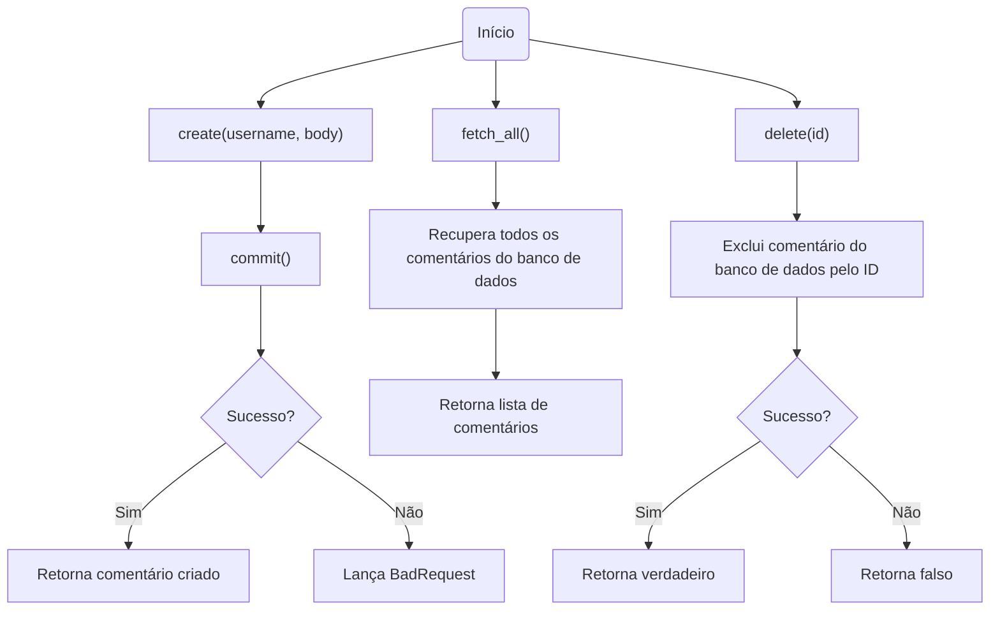
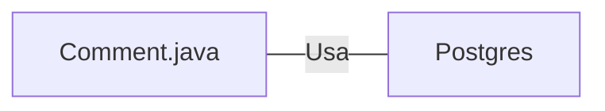

# Comment.java: Gerenciamento de Comentários

## Visão Geral
O código é responsável pelo gerenciamento de comentários em uma aplicação. Ele permite a criação, recuperação e exclusão de comentários. Cada comentário é composto por um ID, nome de usuário, corpo do comentário e a data de criação.

## Fluxo do Processo

## Insights
- A classe `Comment` é uma estrutura de dados que representa um comentário na aplicação.
- A classe `Comment` possui métodos para criar (`create`), recuperar todos (`fetch_all`) e excluir (`delete`) comentários.
- O método `create` cria um novo comentário e tenta salvá-lo no banco de dados através do método `commit`. Se a operação for bem-sucedida, retorna o comentário criado, caso contrário, lança uma exceção `BadRequest`.
- O método `fetch_all` recupera todos os comentários do banco de dados e retorna uma lista de comentários.
- O método `delete` exclui um comentário do banco de dados pelo ID. Retorna verdadeiro se a operação for bem-sucedida, caso contrário, retorna falso.
- O método `commit` é um método privado usado para salvar um comentário no banco de dados.

## Dependências (Opcional)
- A classe `Comment` depende da classe `Postgres` para estabelecer uma conexão com o banco de dados.

- `Postgres`: Classe usada para estabelecer uma conexão com o banco de dados.

## Manipulação de Dados (SQL)
- A classe `Comment` manipula a tabela `comments` no banco de dados.

- `comments`: Tabela que armazena os comentários. Os comentários são inseridos através do método `commit`, recuperados através do método `fetch_all` e excluídos através do método `delete`.

## Vulnerabilidades
- O código não possui tratamento adequado de exceções, o que pode levar a problemas de segurança e estabilidade. Por exemplo, se ocorrer um erro ao tentar conectar-se ao banco de dados, o programa irá falhar e a exceção será impressa no console, mas não será tratada adequadamente.
- O código não utiliza consultas parametrizadas ou outras medidas de proteção contra injeção de SQL, o que pode torná-lo vulnerável a ataques de injeção de SQL.
- O código não valida ou escapa os dados de entrada antes de usá-los para criar um novo comentário, o que pode torná-lo vulnerável a ataques de cross-site scripting (XSS) ou injeção de SQL.
