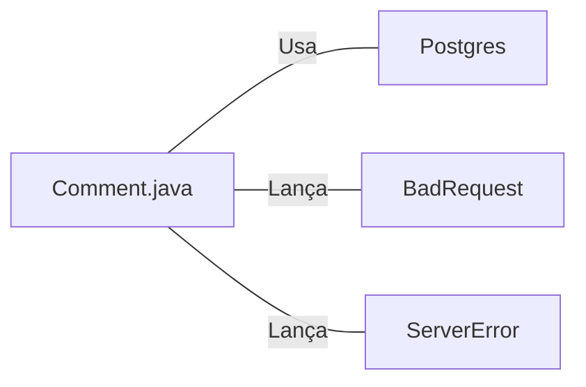

# Comment.java: Gerenciamento de Comentários

## Visão Geral
Este código é responsável pelo gerenciamento de comentários em uma aplicação. Ele permite a criação, recuperação e exclusão de comentários. Cada comentário é composto por um identificador único (id), nome de usuário (username), corpo do comentário (body) e a data de criação (created_on).

## Fluxo do Processo

## Insights
- A classe `Comment` é uma estrutura de dados que representa um comentário na aplicação.
- A classe `Comment` possui métodos para criar (`create`), recuperar todos (`fetch_all`) e deletar (`delete`) comentários.
- O método `create` gera um novo comentário e tenta salvá-lo no banco de dados através do método `commit`. Se a operação for bem-sucedida, retorna o comentário criado, caso contrário, lança uma exceção `BadRequest`.
- O método `fetch_all` recupera todos os comentários do banco de dados e retorna uma lista de objetos `Comment`.
- O método `delete` tenta excluir um comentário específico do banco de dados usando seu `id`. Retorna verdadeiro se a operação for bem-sucedida e falso caso contrário.
- O método `commit` é um método privado usado para salvar um comentário no banco de dados.

## Dependências (Opcional)
A classe `Comment` tem dependências com a classe `Postgres` para conexão com o banco de dados e com as classes `BadRequest` e `ServerError` para tratamento de exceções.

- `Postgres` : Classe utilizada para estabelecer conexão com o banco de dados PostgreSQL. É chamada nos métodos `fetch_all`, `delete` e `commit`.
- `BadRequest` : Exceção lançada quando ocorre um erro ao tentar salvar um comentário no banco de dados.
- `ServerError` : Exceção lançada quando ocorre um erro não esperado durante a criação de um comentário.

## Manipulação de Dados (SQL)
A classe `Comment` manipula a tabela `comments` no banco de dados PostgreSQL.

- `comments`: Tabela que armazena os comentários. As operações realizadas são:
  - `INSERT`: Usada no método `commit` para inserir um novo comentário na tabela.
  - `SELECT`: Usada no método `fetch_all` para recuperar todos os comentários da tabela.
  - `DELETE`: Usada no método `delete` para excluir um comentário específico da tabela.

## Vulnerabilidades
- O código não possui tratamento adequado de exceções, o que pode levar a problemas de segurança e estabilidade. Por exemplo, se ocorrer um erro ao tentar conectar ao banco de dados, o programa irá falhar e a exceção será impressa no console.
- O código não possui validação de entrada, o que pode permitir ataques de injeção de SQL. Por exemplo, o método `delete` aceita um `id` como parâmetro e o usa diretamente na consulta SQL sem qualquer validação ou sanitização.
- O código não fecha corretamente as conexões com o banco de dados, o que pode levar a vazamentos de conexão. Embora o código tente fechar as conexões no bloco `finally`, ele não faz isso corretamente. Se ocorrer uma exceção antes de a conexão ser aberta, o código tentará fechar uma conexão nula, resultando em uma `NullPointerException`.
- O código não usa consultas preparadas de forma consistente, o que pode permitir ataques de injeção de SQL. Embora o método `delete` use uma consulta preparada, o método `fetch_all` não o faz.
