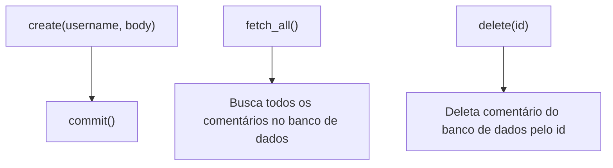
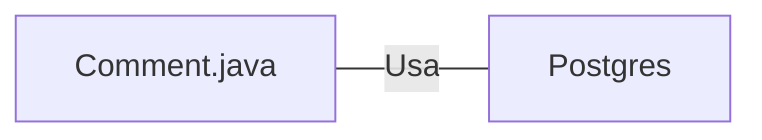

# Comment.java: Gerenciamento de Comentários

## Visão Geral
O código é responsável pelo gerenciamento de comentários em uma aplicação. Ele permite a criação, recuperação e exclusão de comentários de um banco de dados PostgreSQL. Cada comentário é representado como um objeto `Comment` com atributos para `id`, `username`, `body` e `created_on`.

## Fluxo do Processo

## Insights
- A classe `Comment` representa um comentário com atributos para `id`, `username`, `body` e `created_on`.
- O método `create` é usado para criar um novo comentário. Ele gera um UUID para o `id` e um timestamp para `created_on`.
- O método `fetch_all` é usado para recuperar todos os comentários do banco de dados.
- O método `delete` é usado para excluir um comentário do banco de dados com base em seu `id`.
- O método `commit` é usado para salvar um novo comentário no banco de dados.

## Dependências
O código depende da classe `Postgres` para estabelecer uma conexão com o banco de dados PostgreSQL.

- `Postgres` : Usado para estabelecer uma conexão com o banco de dados PostgreSQL.

## Manipulação de Dados (SQL)
- `comments`: Tabela que armazena os comentários. Os comentários são inseridos, recuperados e excluídos desta tabela.

  | Atributo   | Tipo de Dado | Descrição |
  |------------|--------------|-----------|
  | id         | String       | Identificador único do comentário |
  | username   | String       | Nome do usuário que fez o comentário |
  | body       | String       | Corpo do comentário |
  | created_on | Timestamp    | Data e hora da criação do comentário |

- `INSERT INTO comments (id, username, body, created_on) VALUES (?,?,?,?)`: Insere um novo comentário na tabela `comments`.
- `select * from comments;`: Recupera todos os comentários da tabela `comments`.
- `DELETE FROM comments where id = ?`: Exclui um comentário da tabela `comments` com base em seu `id`.

## Vulnerabilidades
- O código não verifica se o `username` existe antes de criar um comentário, o que pode levar a comentários associados a usuários inexistentes.
- O código não verifica se o `id` existe antes de tentar excluir um comentário, o que pode levar a erros se um `id` inexistente for fornecido.
- O código não trata adequadamente as exceções SQL, apenas imprime a pilha de rastreamento e continua, o que pode levar a comportamentos inesperados.
