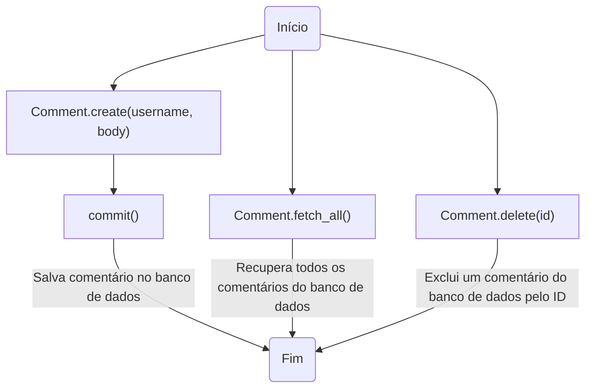
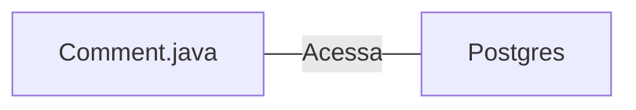

# Comment.java: Gerenciamento de Comentários

## Visão Geral
Este código é responsável pelo gerenciamento de comentários em uma aplicação. Ele permite a criação, recuperação e exclusão de comentários. Cada comentário é composto por um ID, nome de usuário, corpo do comentário e a data de criação.

## Fluxo do Processo

## Insights
- A classe `Comment` representa a estrutura de dados de um comentário.
- A classe `Comment` possui métodos para criar (`create`), recuperar todos (`fetch_all`) e excluir (`delete`) comentários.
- O método `create` gera um novo ID para cada comentário usando `UUID.randomUUID().toString()`.
- O método `fetch_all` recupera todos os comentários do banco de dados.
- O método `delete` exclui um comentário específico do banco de dados usando seu ID.
- O método `commit` é usado para salvar um novo comentário no banco de dados.

## Dependências
- A classe `Comment` depende da classe `Postgres` para estabelecer uma conexão com o banco de dados.

- `Postgres`: Classe usada para estabelecer uma conexão com o banco de dados PostgreSQL.

## Manipulação de Dados (SQL)
- `comments`: Tabela onde os comentários são armazenados. Os comentários são inseridos, recuperados e excluídos desta tabela.

## Vulnerabilidades
- O código não verifica se o usuário que está tentando excluir um comentário é o mesmo usuário que criou o comentário. Isso pode permitir que usuários excluam comentários de outros usuários.
- O código não verifica se o comentário que está sendo excluído existe. Isso pode levar a erros se um ID inválido for fornecido.
- O código não trata adequadamente as exceções SQL. Isso pode levar a vazamentos de informações sensíveis do banco de dados.
- O código não fecha adequadamente as conexões, declarações e conjuntos de resultados do banco de dados. Isso pode levar a vazamentos de memória e esgotar os recursos do banco de dados.
