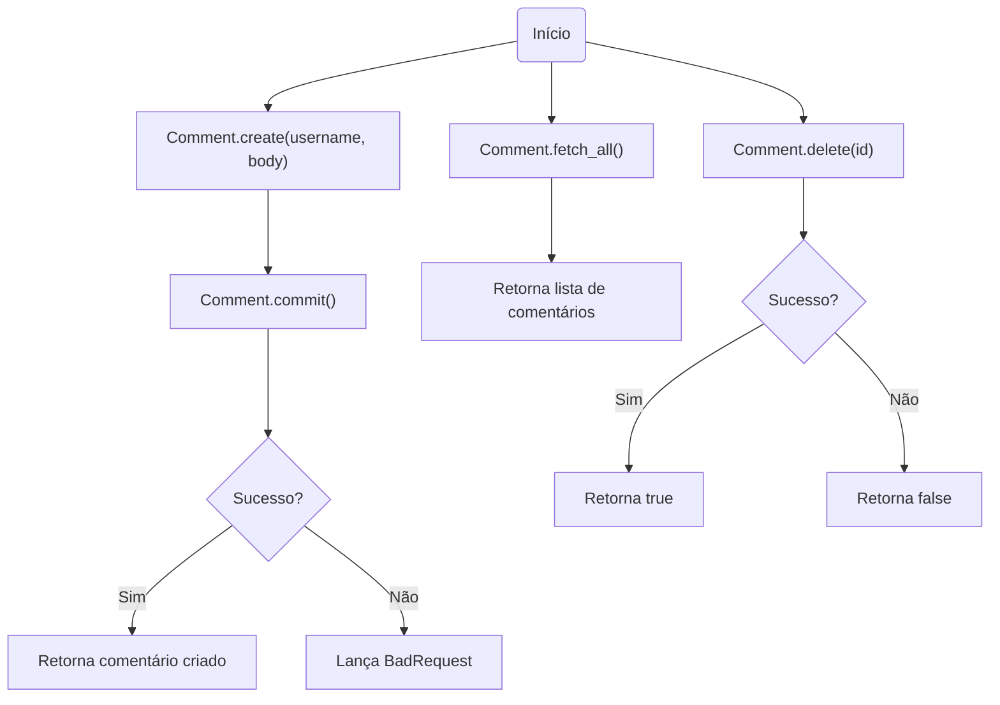
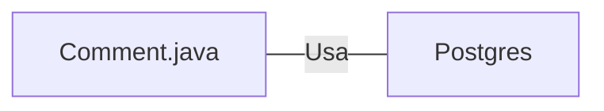

# Comment.java: Gerenciamento de Comentários

## Visão Geral
O código é responsável pelo gerenciamento de comentários em uma aplicação. Ele permite a criação, recuperação e exclusão de comentários. Cada comentário é composto por um identificador único (id), nome de usuário (username), corpo do comentário (body) e a data de criação (created_on).

## Fluxo do Processo

## Insights
- A classe `Comment` é uma estrutura de dados que representa um comentário na aplicação.
- A classe `Comment` possui métodos para criar (`create`), recuperar todos (`fetch_all`) e deletar (`delete`) comentários.
- O método `create` gera um novo comentário e tenta salvá-lo no banco de dados através do método `commit`. Se a operação for bem-sucedida, retorna o comentário criado, caso contrário, lança uma exceção `BadRequest`.
- O método `fetch_all` recupera todos os comentários do banco de dados e retorna uma lista de objetos `Comment`.
- O método `delete` tenta excluir um comentário com base em um id fornecido. Retorna verdadeiro se a operação for bem-sucedida e falso caso contrário.
- O método `commit` é um método privado usado para salvar um comentário no banco de dados.

## Dependências (Opcional)
- A classe `Comment` depende da classe `Postgres` para estabelecer uma conexão com o banco de dados.

- `Postgres`: Classe usada para estabelecer uma conexão com o banco de dados.

## Manipulação de Dados (SQL)
- A classe `Comment` manipula a tabela `comments` no banco de dados.

- `comments`: Tabela que armazena os comentários. As operações realizadas incluem INSERIR (no método `commit`), SELECIONAR (no método `fetch_all`) e DELETAR (no método `delete`).

## Vulnerabilidades
- O código não possui tratamento adequado de exceções, o que pode levar a problemas de segurança e estabilidade. Por exemplo, se ocorrer um erro ao executar uma consulta SQL, a exceção é apenas impressa na saída padrão e o programa continua a execução.
- O código não verifica se os parâmetros fornecidos aos métodos são válidos (por exemplo, se são nulos ou vazios). Isso pode levar a comportamento inesperado ou erros.
- O código não fecha as conexões com o banco de dados em um bloco `finally`, o que pode levar a vazamentos de conexão se ocorrer uma exceção antes que a conexão seja fechada.
