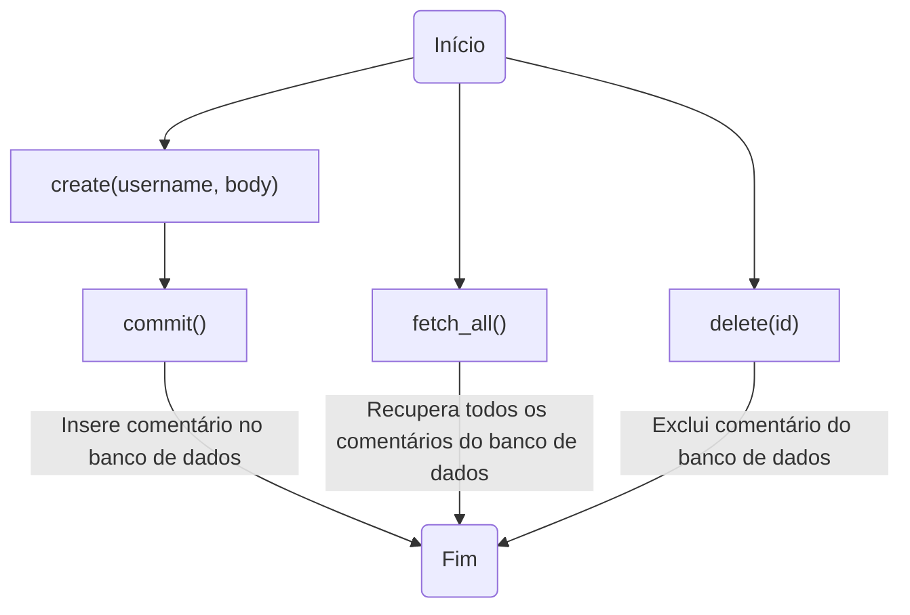
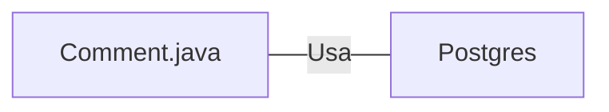

# Comment.java: Gerenciamento de Comentários

## Visão Geral
Este código é responsável pelo gerenciamento de comentários em uma aplicação. Ele permite a criação, recuperação e exclusão de comentários. Cada comentário é composto por um ID, nome de usuário, corpo do comentário e a data de criação.

## Fluxo do Processo

## Insights
- A classe `Comment` representa a estrutura de dados de um comentário.
- A função `create` é usada para criar um novo comentário.
- A função `fetch_all` é usada para recuperar todos os comentários.
- A função `delete` é usada para excluir um comentário específico.
- A função `commit` é usada para inserir o comentário no banco de dados.

## Dependências
- A classe `Comment` depende da classe `Postgres` para estabelecer uma conexão com o banco de dados.

- `Postgres` : Classe usada para estabelecer uma conexão com o banco de dados PostgreSQL.

## Manipulação de Dados (SQL)
- `comments`: Tabela onde os comentários são armazenados. As operações realizadas incluem INSERIR (na função `commit`), SELECIONAR (na função `fetch_all`) e DELETAR (na função `delete`).

## Vulnerabilidades
- O código não verifica se o usuário que está tentando excluir o comentário é o mesmo usuário que criou o comentário. Isso pode permitir que usuários excluam comentários de outros usuários.
- O código não verifica se o comentário que está sendo excluído existe. Isso pode levar a erros se um ID de comentário inválido for fornecido.
- O código não trata adequadamente as exceções SQL. Isso pode levar a vazamentos de informações sensíveis do banco de dados se ocorrer um erro SQL.
