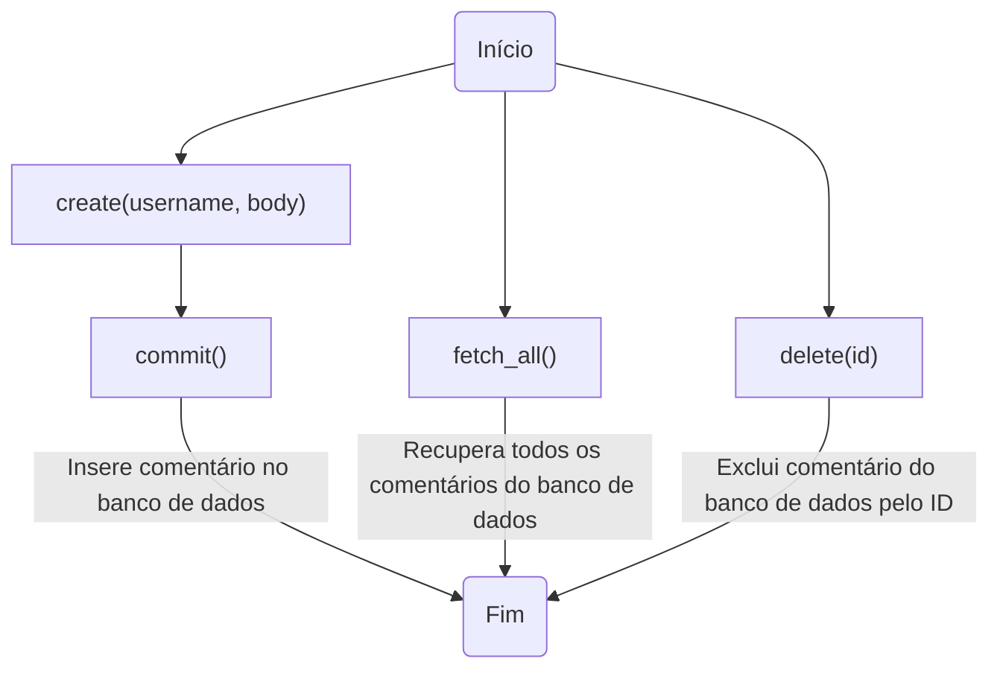
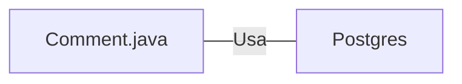

# Comment.java: Gerenciamento de Comentários

## Visão Geral
Este código é responsável pelo gerenciamento de comentários em uma aplicação. Ele permite a criação, recuperação e exclusão de comentários. Cada comentário é composto por um ID, nome de usuário, corpo do comentário e a data de criação.

## Fluxo do Processo

## Insights
- A classe `Comment` é uma estrutura de dados que representa um comentário na aplicação.
- A classe `Comment` possui métodos para criar (`create`), recuperar todos (`fetch_all`) e excluir (`delete`) comentários.
- O método `create` gera um novo ID para cada comentário usando `UUID.randomUUID().toString()`.
- O método `commit` é usado para inserir o comentário no banco de dados.
- O método `fetch_all` recupera todos os comentários do banco de dados.
- O método `delete` exclui um comentário específico do banco de dados usando seu ID.

## Dependências
- A classe `Comment` depende da classe `Postgres` para estabelecer uma conexão com o banco de dados.

- `Postgres` : Classe usada para estabelecer uma conexão com o banco de dados PostgreSQL. A classe `Comment` usa essa conexão para inserir, recuperar e excluir comentários.

## Manipulação de Dados (SQL)
- A classe `Comment` manipula a tabela `comments` no banco de dados.

- `comments`: Tabela que armazena os comentários. Os comentários são inseridos com o método `commit`, recuperados com o método `fetch_all` e excluídos com o método `delete`.

| Atributo | Tipo | Descrição |
| --- | --- | --- |
| id | String | Identificador único do comentário |
| username | String | Nome do usuário que fez o comentário |
| body | String | Corpo do comentário |
| created_on | Timestamp | Data e hora da criação do comentário |

## Vulnerabilidades
- O código não verifica se o usuário que está tentando excluir um comentário é o mesmo usuário que criou o comentário. Isso pode permitir que usuários excluam comentários de outros usuários.
- O código não verifica se o comentário que está sendo excluído existe. Isso pode levar a erros se um ID inválido for fornecido.
- O código não trata adequadamente as exceções SQL. Ele simplesmente imprime a pilha de rastreamento e retorna `false`. Isso pode expor detalhes sensíveis do banco de dados em caso de erro.
