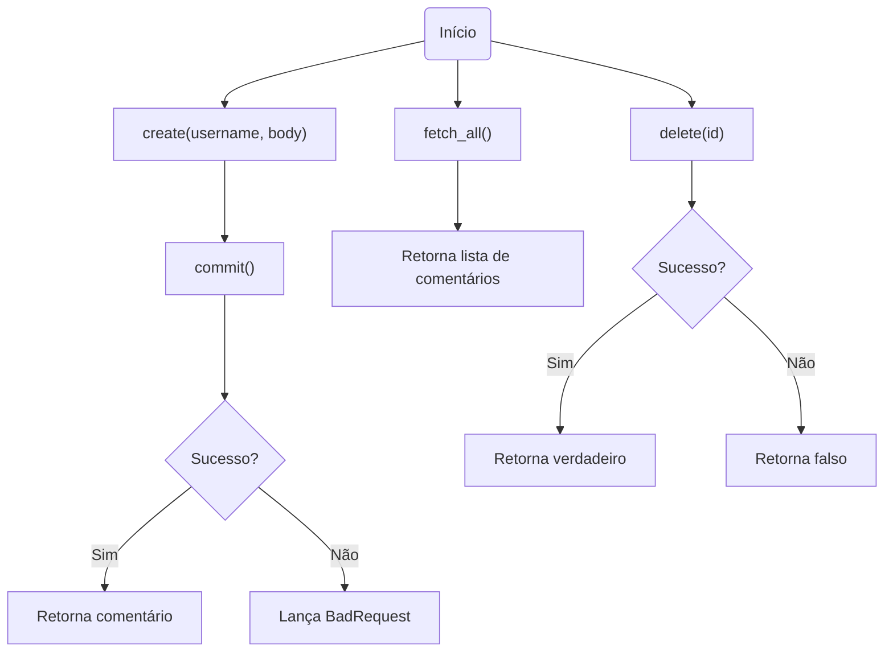
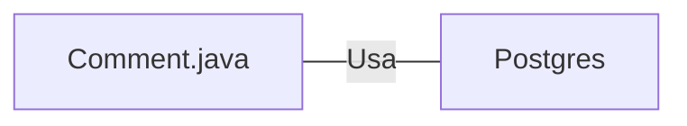

# Comment.java: Gerenciamento de Comentários

## Visão Geral
Este código é responsável pelo gerenciamento de comentários em uma aplicação. Ele permite a criação, recuperação e exclusão de comentários. Cada comentário é composto por um ID, nome de usuário, corpo do comentário e a data de criação.

## Fluxo do Processo

## Insights
- A classe `Comment` é uma estrutura de dados que representa um comentário na aplicação.
- A função `create` é usada para criar um novo comentário.
- A função `fetch_all` é usada para recuperar todos os comentários.
- A função `delete` é usada para excluir um comentário específico.
- A função `commit` é usada para salvar um comentário no banco de dados.

## Dependências (Opcional)

- `Postgres` : É usado para estabelecer uma conexão com o banco de dados e executar consultas SQL.

## Manipulação de Dados (SQL) (Opcional)
- `comments`: Tabela que armazena os comentários. As operações realizadas são:
  - `INSERT INTO comments (id, username, body, created_on) VALUES (?,?,?,?)`: Insere um novo comentário na tabela.
  - `select * from comments;`: Recupera todos os comentários da tabela.
  - `DELETE FROM comments where id = ?`: Exclui um comentário específico da tabela.

## Vulnerabilidades
- O código não possui tratamento adequado de exceções, o que pode levar a comportamentos inesperados.
- O código não verifica se o usuário que está tentando excluir um comentário é o mesmo usuário que criou o comentário. Isso pode permitir que usuários excluam comentários de outros usuários.
- O código não verifica se o comentário que está sendo criado é válido (por exemplo, se o corpo do comentário está vazio). Isso pode permitir a criação de comentários inválidos.
- O código não fecha as conexões com o banco de dados em caso de erro, o que pode levar a vazamentos de conexão.
